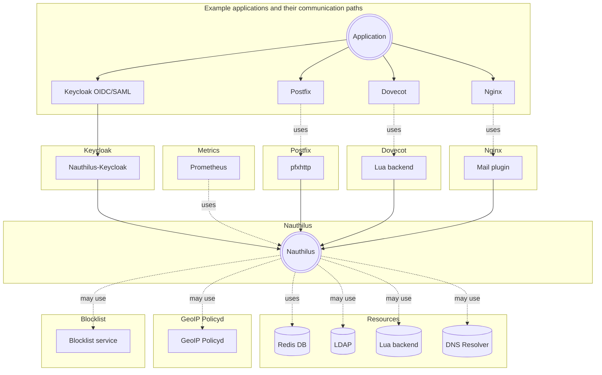

# The Big Picture

See how Nauthilus is integrated into a larger IT ecosystem.

## What is Nauthilus?

Nauthilus is a universal authentication and authorization platform written in Go. It serves as a central hub for handling various authentication requests from different services such as mail servers (SMTP, IMAP, POP3), web applications via the native Identity Provider (OIDC/SAML2), and custom applications through its flexible API.

## Components

Nauthilus interacts with a number of different services around it. To get an idea of how these components work together and what you can achieve with this software, the following diagram provides a detailed overview.

## Key Features

Nauthilus provides a wide range of features, including:

- Multiple authentication backends (LDAP, Lua scripts)
- Redis-based caching for performance optimization
- Brute force attack protection
- Realtime blackhole list (RBL) checking
- Native Identity Provider (OIDC Authorization Code) and SAML2 for Single Sign-On
- Extensibility through Lua scripts
- Comprehensive monitoring via Prometheus metrics

For a complete list of features, see the [Features](./current-features.md) page.

## Additional Notes

Built-in MySQL/MariaDB, PostgreSQL, and SQLite support is available by using the Lua backend.

## Related Projects

| Project             | Link                                                                                               |
|---------------------|----------------------------------------------------------------------------------------------------|
| nauthilus-keycloak  | [https://github.com/croessner/nauthilus-keycloak](https://github.com/croessner/nauthilus-keycloak) |
| pfxhttp             | [https://github.com/croessner/pfxhttp](https://github.com/croessner/pfxhttp)                       |
| geoip-policyd       | [https://github.com/croessner/geoip-policyd](https://github.com/croessner/geoip-policyd)           |
| blocklist           | Bundled with Nauthilus                                                                             |

## Getting Started

Ready to deploy Nauthilus? Check out our [Getting Started](./getting-started.md) guide for deployment options, configuration examples, and integration instructions.