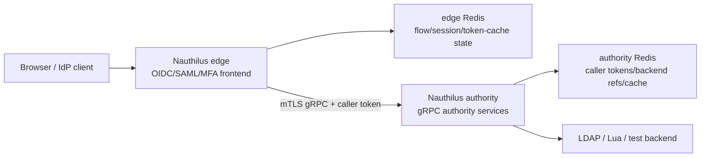
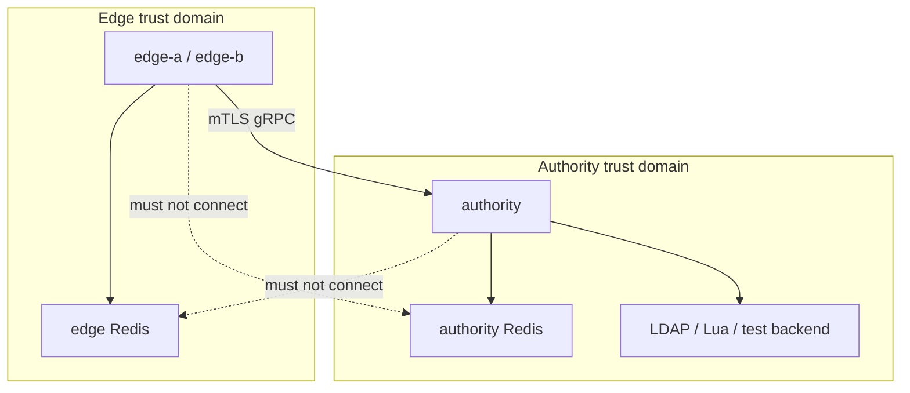

# Split Identity Proxy Configuration

The split identity proxy configuration separates browser-facing IdP work from persistent identity backend ownership.

- **Edge instances** terminate public OIDC/SAML/MFA/WebAuthn browser flows and store only edge-owned flow/session state.
- **Authority instances** own local backend access, persistent identity data, MFA data, WebAuthn credentials, backend references, and authority-side caller tokens.
- **Remote backends** let the edge use the authority through hardened internal gRPC without direct LDAP, Lua, or authority Redis access.

This page documents the configuration surface. For a step-by-step deployment guide, see [Building a Distributed Identity Proxy](../guides/distributed-identity-proxy.md).

## Minimal Shape



The edge and authority can run the same Nauthilus binary. The role comes from configuration.

## Authority-Side Configuration

The authority needs:

- a local backend such as LDAP, Lua, or the test backend;
- a gRPC authority listener;
- caller authentication for authority RPCs;
- Redis for caller tokens, backend references, idempotency, and backend cache;
- optional HTTP/OIDC token endpoint when edge caller auth uses client credentials.

### gRPC Authority Listener

```yaml
runtime:
  servers:
    grpc:
      authority:
        enabled: true
        address: "0.0.0.0:9444"
        tls:
          enabled: true
          cert: "/etc/nauthilus/tls/authority.crt"
          key: "/etc/nauthilus/tls/authority.key"
          client_ca: "/etc/nauthilus/tls/edge-ca.crt"
          require_client_cert: true
          min_tls_version: "TLS1.3"
```

Non-loopback authority listeners must use TLS. Split deployments should use mTLS so the authority can bind backend references to the edge client identity.

### Authority Caller Authentication

Authority RPCs use the same backchannel caller-auth roots as other internal API surfaces:

```yaml
auth:
  backchannel:
    oidc_bearer:
      enabled: true
```

For service-principal caller tokens, enable OIDC and define a client that can use `client_credentials`. `private_key_jwt` is the recommended method for edge-to-authority caller tokens:

```yaml
identity:
  oidc:
    enabled: true
    issuer: "https://authority.internal.example"
    access_token_type: "opaque"
    token_endpoint_auth_methods_supported:
      - private_key_jwt
    scopes_supported:
      - openid
      - nauthilus:authenticate
      - nauthilus:lookup_identity
      - nauthilus:list_accounts
      - nauthilus:mfa_read
      - nauthilus:mfa_verify
      - nauthilus:mfa_write
      - nauthilus:webauthn_read
      - nauthilus:webauthn_write
      - nauthilus:attribute_read
    clients:
      - name: "Edge service principal"
        client_id: "edge-primary"
        grant_types:
          - client_credentials
        token_endpoint_auth_method: "private_key_jwt"
        client_public_key_file: "/etc/nauthilus/keys/edge-primary.pub"
        client_public_key_algorithm: "RS256"
        access_token_type: "opaque"
        access_token_lifetime: 5m
        scopes:
          - nauthilus:authenticate
          - nauthilus:lookup_identity
          - nauthilus:list_accounts
          - nauthilus:mfa_read
          - nauthilus:mfa_verify
          - nauthilus:mfa_write
          - nauthilus:webauthn_read
          - nauthilus:webauthn_write
          - nauthilus:attribute_read
```

Opaque caller tokens are stored and validated by the authority using authority Redis.

### Local Authority Backend

The authority keeps the normal local backend configuration:

```yaml
auth:
  backends:
    order:
      - ldap
    ldap:
      default:
        # LDAP backend settings
```

or:

```yaml
auth:
  backends:
    order:
      - lua
    lua:
      backend:
        default:
          # Lua backend settings
```

The authority is the only role that needs these backend credentials in a strict split deployment.

## Edge-Side Configuration

The edge needs:

- browser-facing HTTP/HTTPS IdP endpoints;
- edge Redis for sessions and IdP flow state;
- an outbound authority client;
- a remote backend definition that references the outbound authority client;
- OIDC/SAML client or SP-facing configuration as usual.

### Outbound Authority Client

```yaml
runtime:
  clients:
    grpc:
      nauthilus_authorities:
        primary:
          address: "authority.internal.example:9444"
          timeout: 5s
          edge_cluster_id: "dmz-edge"
          edge_instance_id: "edge-a"
          tls:
            enabled: true
            server_name: "authority.internal.example"
            ca: "/etc/nauthilus/tls/authority-ca.pem"
            cert: "/etc/nauthilus/tls/edge-a.crt"
            key: "/etc/nauthilus/tls/edge-a.key"
            min_tls_version: "TLS1.3"
          caller_auth:
            oidc_bearer:
              enabled: true
              mode: "client_credentials"
              token_endpoint: "https://authority.internal.example/oidc/token"
              client_id: "edge-primary"
              token_endpoint_auth_method: "private_key_jwt"
              client_private_key_file: "/etc/nauthilus/keys/edge-primary.key"
              client_key_id: "edge-primary-rs256"
              client_assertion_alg: "RS256"
              audience: "https://authority.internal.example/oidc/token"
              scopes:
                - nauthilus:authenticate
                - nauthilus:lookup_identity
                - nauthilus:list_accounts
                - nauthilus:mfa_read
                - nauthilus:mfa_verify
                - nauthilus:mfa_write
                - nauthilus:webauthn_read
                - nauthilus:webauthn_write
                - nauthilus:attribute_read
              token_cache:
                backend: "redis"
                key_prefix: "grpc:authority_tokens:"
                refresh_before_expiry: 30s
                refresh_lock_ttl: 10s
```

#### Authority Client Fields

| Path | Required | Default | Description |
| --- | --- | --- | --- |
| `address` | yes | none | Authority gRPC target as `host:port`. |
| `timeout` | no | `5s` | Authority RPC timeout, maximum one minute. |
| `edge_cluster_id` | recommended | empty | Stable cluster identifier used in metadata and backend-reference validation. |
| `edge_instance_id` | recommended | empty | Edge node identifier used in metadata and logs. |
| `split_strict_mode` | no | `true` | Enables strict split-deployment safety checks where applicable. |
| `tls.enabled` | required off-loopback | `false` | Enables TLS for the outbound authority client. |
| `tls.server_name` | recommended | target host | Server name used for certificate verification. |
| `tls.ca` | required off-loopback with TLS | none | CA bundle for authority server verification. |
| `tls.cert` | required off-loopback with mTLS | none | Edge client certificate. |
| `tls.key` | required off-loopback with mTLS | none | Edge client private key. |
| `tls.min_tls_version` | no | `TLS1.2` | `TLS1.2` or `TLS1.3`. Use `TLS1.3` for new split deployments. |

Plaintext authority clients are accepted only for loopback targets. Non-loopback authority targets require TLS and, in split deployments, mTLS certificate material.

### Caller Auth Fields

The current recommended caller-auth mode is OIDC bearer tokens from the authority token endpoint:

| Path | Required | Default | Description |
| --- | --- | --- | --- |
| `caller_auth.oidc_bearer.enabled` | yes | `false` | Enables client-credentials caller-token acquisition. |
| `caller_auth.oidc_bearer.mode` | yes | none | Must be `client_credentials`. |
| `caller_auth.oidc_bearer.token_endpoint` | yes | none | Authority OIDC token endpoint. |
| `caller_auth.oidc_bearer.client_id` | yes | none | Edge service-principal client id. |
| `caller_auth.oidc_bearer.token_endpoint_auth_method` | yes | none | `private_key_jwt`, `client_secret_basic`, or `client_secret_post`. |
| `caller_auth.oidc_bearer.client_private_key_file` | for `private_key_jwt` | none | Private key used to sign the client assertion. |
| `caller_auth.oidc_bearer.client_key_id` | recommended | empty | `kid` for the client assertion. |
| `caller_auth.oidc_bearer.client_assertion_alg` | for `private_key_jwt` | none | `RS256` or `EdDSA`. |
| `caller_auth.oidc_bearer.audience` | recommended | token endpoint | JWT audience expected by the authority. |
| `caller_auth.oidc_bearer.client_secret` | for client-secret methods | none | Client secret for `client_secret_basic` or `client_secret_post`. |
| `caller_auth.oidc_bearer.scopes` | recommended | empty | Authority scopes requested by the edge. |
| `caller_auth.oidc_bearer.static_token_file` | dev/emergency only | empty | Static bearer token file. Requires developer or emergency mode. |
| `caller_auth.oidc_bearer.static_token_emergency_mode` | no | `false` | Allows static-token use outside developer mode. |

### Token Cache Fields

| Path | Required | Default | Description |
| --- | --- | --- | --- |
| `token_cache.backend` | no | `redis` | Cache backend. The current supported value is `redis`. |
| `token_cache.key_prefix` | no | `grpc:authority_tokens:` | Redis key prefix for edge-cached authority caller tokens. |
| `token_cache.refresh_before_expiry` | no | `30s` | Refresh skew before token expiry. |
| `token_cache.refresh_lock_ttl` | no | `10s` | Distributed refresh-lock TTL for multi-edge deployments. |

The token cache belongs to edge Redis, not authority Redis.

### Remote Backend

```yaml
auth:
  backends:
    order:
      - remote
    remote:
      default:
        authority: "primary"
        mode: "nauthilus"
        timeout: 5s
        allowed_operations:
          - auth
          - lookup_identity
          - list_accounts
          - mfa_read
          - mfa_verify
          - mfa_write
          - webauthn_read
          - webauthn_write
          - attribute_read
```

See [Remote Authority Backend](database-backends/remote.md) for the backend-specific reference.

## Required Scopes

The authority checks OAuth scopes independently from the edge `allowed_operations` list:

| Scope | Typical remote operation |
| --- | --- |
| `nauthilus:authenticate` | `Authenticate` |
| `nauthilus:lookup_identity` | `LookupIdentity`, identity resolution |
| `nauthilus:list_accounts` | `ListAccounts` |
| `nauthilus:mfa_read` | Read MFA state |
| `nauthilus:mfa_verify` | Verify TOTP or consume recovery codes |
| `nauthilus:mfa_write` | Register/delete TOTP and recovery codes |
| `nauthilus:webauthn_read` | Read WebAuthn public credentials |
| `nauthilus:webauthn_write` | Save, update, or delete WebAuthn credentials |
| `nauthilus:attribute_read` | Read identity attributes for OIDC/SAML claims |

Grant only the scopes the edge actually needs.

## Redis Separation

Use separate Redis instances or hard network separation:



This split matters because edge Redis contains public IdP flow and session state, while authority Redis contains backend references, caller access tokens, idempotency outcomes, and backend cache data. Do not share a Redis database between the two roles.

## Standalone Compatibility

Split identity proxy is optional. A single Nauthilus instance can still run as IdP and authority in one process:

```yaml
runtime:
  servers:
    grpc:
      authority:
        enabled: true

auth:
  backends:
    order:
      - ldap
```

In that shape, the same process owns the IdP endpoints, the local backend, and optionally the gRPC authority listener. Do not configure `auth.backends.order: [remote]` against itself unless you explicitly want to test the remote path; local backends are the normal standalone model.
