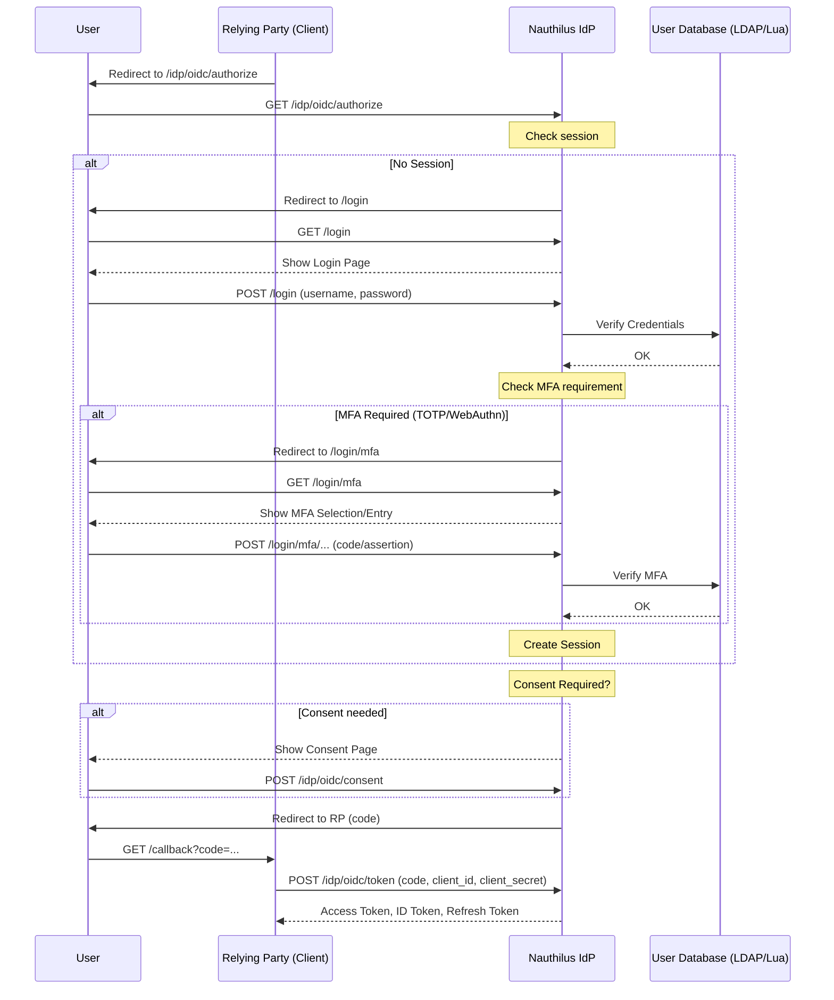

# OIDC (Authorization Code + Device Code)

Nauthilus provides a built-in OpenID Connect (OIDC) Identity Provider implementing the Authorization Code grant and the Device Authorization Grant (RFC 8628).

## Authentication Flow

The following diagram shows the typical OIDC Authorization Code flow, including optional MFA and consent steps.



This page covers endpoints, discovery, client authentication, logout variants, and all configuration options.

## Endpoints

- Discovery: `GET /idp/oidc/.well-known/openid-configuration`
- Authorization: `GET /idp/oidc/authorize`
- Token: `POST /idp/oidc/token` (authorization_code, refresh_token, urn:ietf:params:oauth:grant-type:device_code)
- Introspection: `POST /idp/oidc/introspect`
- UserInfo: `GET /idp/oidc/userinfo`
- JWKS: `GET /idp/oidc/jwks`
- Logout: `GET /idp/oidc/logout`
- Device Authorization: `POST /idp/oidc/device/authorize`
- Device Verification: `GET /idp/oidc/device/verify`

## Discovery document

Example fields returned by `/.well-known/openid-configuration`:

```json
{
  "issuer": "https://idp.example.com/idp",
  "authorization_endpoint": "https://idp.example.com/idp/oidc/authorize",
  "token_endpoint": "https://idp.example.com/idp/oidc/token",
  "introspection_endpoint": "https://idp.example.com/idp/oidc/introspect",
  "userinfo_endpoint": "https://idp.example.com/idp/oidc/userinfo",
  "jwks_uri": "https://idp.example.com/idp/oidc/jwks",
  "end_session_endpoint": "https://idp.example.com/idp/oidc/logout",
  "frontchannel_logout_supported": true,
  "frontchannel_logout_session_supported": false,
  "backchannel_logout_supported": true,
  "backchannel_logout_session_supported": false,
  "response_types_supported": ["code"],
  "subject_types_supported": ["public"],
  "id_token_signing_alg_values_supported": ["RS256"],
  "scopes_supported": ["openid","profile","email","groups","offline_access"],
  "token_endpoint_auth_methods_supported": ["client_secret_basic","client_secret_post"],
  "introspection_endpoint_auth_methods_supported": ["client_secret_basic","client_secret_post"],
  "claims_supported": ["sub","name","email","email_verified","preferred_username","given_name","family_name","groups"]
}
```

Notes:
- Only `response_type=code` is supported.
- Front-/Back-channel logout are supported; session variants may be no-ops depending on client support.

## Client authentication

- `client_secret_basic` and `client_secret_post` are supported at the token and introspection endpoints.

## Access tokens

- Access tokens can be JWT or opaque (configurable default and per client override).
- Default lifetimes can be overridden per client.

## Configuration

Top-level section: `idp.oidc`

```yaml
idp:
  oidc:
    enabled: true
    issuer: "https://idp.example.com/idp"

    # Signing keys (inline or via files). One or more keys can be configured; mark the active one.
    signing_keys:
      - id: "2026-01-key"
        key_file: "/etc/nauthilus/keys/oidc-2026-01.pem"
        active: true

    # Optional key rotation
    auto_key_rotation: false
    key_rotation_interval: 168h   # 7 days
    key_max_age: 720h             # 30 days

    # Supported values advertised in the discovery document
    scopes_supported: ["openid","profile","email","groups","offline_access"]
    response_types_supported: ["code"]
    subject_types_supported: ["public"]
    id_token_signing_alg_values_supported: ["RS256"]
    token_endpoint_auth_methods_supported: ["client_secret_basic","client_secret_post"]
    claims_supported: ["sub","name","email","email_verified","preferred_username","given_name","family_name","groups"]

    # Custom scopes map to claims (server-wide declarations)
    custom_scopes:
      - name: "tenant"
        description: "Tenant information"
        claims:
          - name: tenant_id
            type: string
          - name: tenant_name
            type: string

    # Token defaults
    access_token_type: "jwt"      # or "opaque"
    default_access_token_lifetime: 3600s
    default_refresh_token_lifetime: 4320h

    # Device Code Flow (RFC 8628)
    device_code_expiry: 600s
    device_code_polling_interval: 5
    device_code_user_code_length: 8

    # Clients
    clients:
      - name: "Example Web App"
        client_id: "example-web"
        client_secret: "change-me"
        redirect_uris: ["https://app.example.com/callback"]
        scopes: ["openid","profile","email","offline_access"]
        grant_types: ["authorization_code"]
        skip_consent: false
        delayed_response: false
        remember_me_ttl: 720h
        access_token_lifetime: 7200s
        access_token_type: "jwt"
        refresh_token_lifetime: 4320h
        token_endpoint_auth_method: "client_secret_basic"
        # For private_key_jwt authentication:
        # client_public_key_file: "/etc/nauthilus/keys/client-pub.pem"
        # client_public_key_algorithm: "RS256"
        id_token_claims:
          mappings:
            - claim: name
              attribute: cn
            - claim: email
              attribute: mail
            - claim: email_verified
              attribute: mailVerified
              type: bool
        access_token_claims:
          mappings:
            - claim: tenant_id
              attribute: tenantId
              type: string
        post_logout_redirect_uris: ["https://app.example.com/logout-callback"]
        backchannel_logout_uri: "https://app.example.com/backchannel-logout"
        frontchannel_logout_uri: "https://app.example.com/frontchannel-logout"
        frontchannel_logout_session_required: true
        logout_redirect_uri: "https://app.example.com/"
```

### Settings reference

- `enabled` (bool): Enable/disable the OIDC provider
- `issuer` (string): External issuer base URL used in discovery/JWKS
- `signing_keys` (list): One or more keys (inline `key` or `key_file`), with `id` and `active`
- `auto_key_rotation` (bool), `key_rotation_interval` (duration), `key_max_age` (duration)
- `custom_scopes` (list): Named custom scopes mapping to `claims`
- Supported-values arrays used for discovery: `scopes_supported`, `response_types_supported`, `subject_types_supported`, `id_token_signing_alg_values_supported`, `token_endpoint_auth_methods_supported`, `claims_supported`
- Token defaults: `access_token_type`, `default_access_token_lifetime`, `default_refresh_token_lifetime`
- Device Code Flow: `device_code_expiry` (duration), `device_code_polling_interval` (int, seconds), `device_code_user_code_length` (int)
- `clients` (list of OIDCClient):
  - `name`, `client_id`, `client_secret`, `redirect_uris`
  - `scopes`, `grant_types` (list, default: `["authorization_code"]`)
  - `skip_consent`, `delayed_response`, `remember_me_ttl`
  - `access_token_lifetime`, `access_token_type`, `refresh_token_lifetime`
  - `token_endpoint_auth_method`
  - `client_public_key` or `client_public_key_file`, `client_public_key_algorithm` (for `private_key_jwt` auth)
  - `id_token_claims` with `mappings[]` (`claim`, `attribute`, `type`)
  - `access_token_claims` with `mappings[]` (`claim`, `attribute`, `type`)
  - `post_logout_redirect_uris`, `backchannel_logout_uri`, `frontchannel_logout_uri`, `frontchannel_logout_session_required`, `logout_redirect_uri`

## Device Authorization Grant (RFC 8628)

Nauthilus supports the Device Authorization Grant for input-constrained devices (smart TVs, CLI tools, IoT devices).

### Flow

1. The device requests a device code via `POST /idp/oidc/device/authorize` with `client_id` and `scope`.
2. The user visits the verification URL and enters the user code shown on the device.
3. The user authenticates and authorizes the device.
4. The device polls `POST /idp/oidc/token` with `grant_type=urn:ietf:params:oauth:grant-type:device_code` until the user completes authorization.

### Configuration

Device code settings are configured under `idp.oidc`:

```yaml
idp:
  oidc:
    device_code_expiry: 600s         # How long a device code is valid (default: 600s)
    device_code_polling_interval: 5  # Minimum polling interval in seconds (default: 5)
    device_code_user_code_length: 8  # Length of the user code (default: 8)
```

Clients must include `urn:ietf:params:oauth:grant-type:device_code` in their `grant_types` to use this flow:

```yaml
    clients:
      - name: "CLI Tool"
        client_id: "cli-tool"
        client_secret: "cli-secret"
        grant_types: ["authorization_code", "urn:ietf:params:oauth:grant-type:device_code"]
        scopes: ["openid", "profile", "email"]
```

## Using custom scopes and claims

Custom scopes allow you to expose additional claims in ID tokens, access tokens, and the UserInfo response based on attributes coming from your user backend (LDAP or Lua).

How it fits together:
- Server-wide you declare `idp.oidc.custom_scopes[]` with a `name` and a list of `claims { name, type }`.
- Per client you map claim names to backend attributes using `id_token_claims.mappings[]` and `access_token_claims.mappings[]`.
- At runtime, only claims for scopes requested by the client are included.

Example (end-to-end):

```yaml
idp:
  oidc:
    custom_scopes:
      - name: tenant
        description: "Expose the user's tenant"
        claims:
          - name: tenant
            type: string
    clients:
      - client_id: demo
        client_secret: s3cr3t
        redirect_uris: ["https://app.example/callback"]
        scopes: ["openid", "profile", "email", "tenant"]
        id_token_claims:
          mappings:
            - claim: tenant
              attribute: tenant
              type: string
```

Backend attribute source:
- LDAP: ensure the LDAP search populates an attribute key `tenant` (e.g., from `departmentNumber` or a custom attribute). The key must appear in the session attribute map.
- Lua: in your backend plugin, set `attributes["tenant"] = "acme"` in the result.

Client request:
- The RP includes the scope in the authorization request, e.g. `scope=openid profile email tenant`.

Resulting ID token excerpt:

```json
{
  "sub": "1234567890",
  "preferred_username": "alice",
  "tenant": "acme"
}
```

Notes:
- Standard claims (e.g., `email_verified`, `phone_number_verified`, `address`, `updated_at`, `groups`) are also gated by their respective scopes (`email`, `phone`, `address`, `profile`, `groups`).
- Custom claims are only included when their scope was requested.

## Built-in `nauthilus:*` scopes

Nauthilus defines a set of reserved scopes prefixed with `nauthilus:`. These scopes control access to internal features and the backchannel API. They are **not** standard OIDC scopes and are specific to Nauthilus.

| Scope | Purpose |
|---|---|
| `nauthilus:authenticate` | Base scope required for all backchannel API access (`/api/v1/*`). Every OIDC Bearer token used against the API must include this scope. |
| `nauthilus:admin` | Grants full administrative access to the backchannel API, including brute-force listing and metrics endpoints. |
| `nauthilus:security` | Grants access to security-related features such as Prometheus metrics and brute-force listing. Can be used as an alternative to `nauthilus:admin` for read-only security operations. |
| `nauthilus:list_accounts` | Grants access to the list-accounts mode on the backchannel API. Required when using the account listing endpoint. |
| `nauthilus:mfa:manage` | Grants access to MFA registration and management pages. This scope is included in the default `scopes_supported` set and allows users to enroll or manage TOTP and WebAuthn credentials. SAML service providers can also leverage MFA management via `allow_mfa_manage`. |

### Usage

These scopes are used with OIDC Bearer token authentication on the backchannel API (`server.oidc_auth.enabled: true`). A client using the `client_credentials` grant type requests the required scopes:

```yaml
server:
  oidc_auth:
    enabled: true

idp:
  oidc:
    clients:
      - name: "API Client"
        client_id: "api-client"
        client_secret: "super-secret"
        grant_types: ["client_credentials"]
        scopes: ["nauthilus:authenticate", "nauthilus:admin"]
```

The middleware validates the token and checks for the required scopes:

- All `/api/v1/*` requests require `nauthilus:authenticate`.
- Brute-force listing and metrics require `nauthilus:security` or `nauthilus:admin`.
- The list-accounts mode requires `nauthilus:list_accounts`.

The `nauthilus:mfa:manage` scope is also relevant for interactive sessions (Authorization Code flow) where users manage their MFA credentials.

### Lua custom hooks

When using Lua custom hooks with OIDC authentication, the `scopes` field on each hook restricts access to tokens carrying the listed scopes. You can use any combination of `nauthilus:*` scopes or custom scopes:

```yaml
lua:
  custom_hooks:
    - http_location: /api/v1/custom/example
      http_method: GET
      script_path: /etc/nauthilus/lua/hooks/example.lua
      scopes:
        - "nauthilus:admin"
```

See also: [Lua custom hooks](../database-backends/lua.md)

## Headers and logging

- The server can propagate an OIDC Client ID header for logs/filters via `server::default_http_request_header::oidc_cid`.

## Metrics

- Prometheus counters/gauges are exposed for OIDC logins, tokens issued, consent, and MFA operations.
