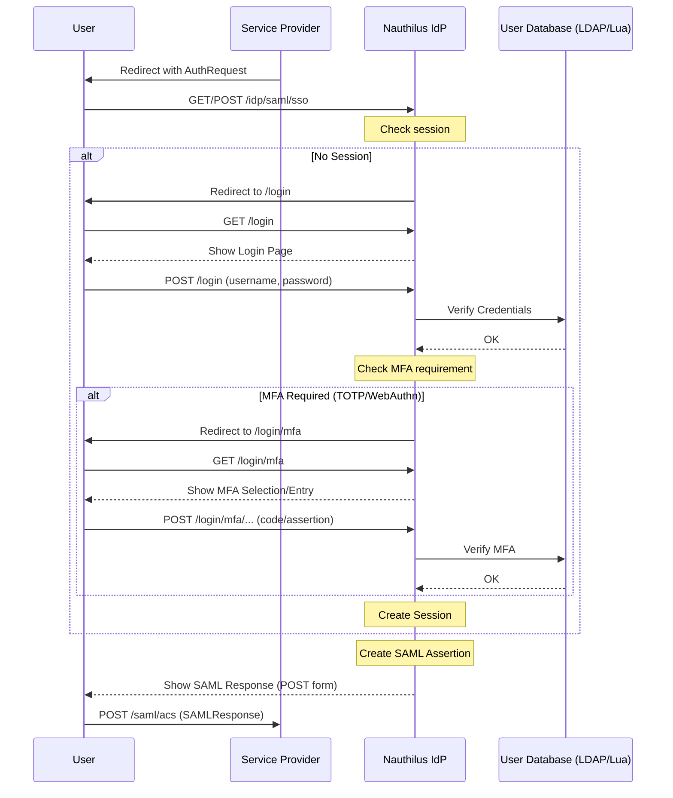

# SAML 2.0 IdP

Nauthilus includes a native SAML 2.0 Identity Provider.

## Authentication Flow

The following diagram shows the typical SAML2 Single Sign-On flow.



This page covers endpoints, basic flows, and configuration.

## Endpoints

- Metadata: `GET /idp/saml/metadata`
- SSO: `GET /idp/saml/sso`
- SLO: `GET /idp/saml/slo`

Notes:
- Current SLO support terminates the local session; front-/back-channel SLO with SPs depends on client/SP support.

## Configuration

Top-level section: `idp.saml2`

```yaml
idp:
  saml2:
    enabled: true
    entity_id: "https://idp.example.com/idp/saml"

    # Either inline key/cert or via files
    cert_file: "/etc/nauthilus/saml/idp.pem"
    key_file: "/etc/nauthilus/saml/idp.key"

    # Defaults
    signature_method: "rsa-sha256"
    default_expire_time: 1h
    name_id_format: "urn:oasis:names:tc:SAML:2.0:nameid-format:persistent"

    # Service Providers
    service_providers:
      - name: "Example SP"
        entity_id: "https://sp.example.com/metadata"
        acs_url: "https://sp.example.com/saml/acs"
        slo_url: "https://sp.example.com/saml/slo"
        cert_file: "/etc/nauthilus/saml/sp.pem"
        allowed_attributes: ["mail", "cn", "uid", "memberOf"]
        delayed_response: false
        remember_me_ttl: 720h
        logout_redirect_uri: "https://sp.example.com/"
        allow_mfa_manage: true
```

### Settings reference

- `enabled` (bool): Enable/disable the SAML IdP
- `entity_id` (string): The IdP EntityID published in metadata
- `cert`/`cert_file` and `key`/`key_file`: X.509 certificate and private key for signing
- `signature_method` (string): Currently `rsa-sha256`
- `default_expire_time` (duration): ID/Assertion validity
- `name_id_format` (string): Default NameIDFormat (persistent recommended)
- `service_providers` (list of SAML2ServiceProvider):
  - `name` (string): Human-readable name for the service provider
  - `entity_id` (required), `acs_url` (required), `slo_url` (optional)
  - `cert` or `cert_file`: SP certificate (inline or file path) for signature verification
  - `allowed_attributes` (list of strings): Restrict which attributes are released to this SP. If empty, all attributes are allowed.
  - `delayed_response` (bool)
  - `remember_me_ttl` (duration)
  - `logout_redirect_uri` (string)
  - `allow_mfa_manage` (bool): When `true`, users authenticated via this SP can access MFA registration and management pages (TOTP/WebAuthn enrollment). This corresponds to the `nauthilus:mfa:manage` scope in OIDC. Default: `false`.

## MFA and Consent

- SAML flows leverage the same integrated login, consent, and MFA (TOTP/WebAuthn) UI as OIDC.
- To allow users authenticated through a SAML SP to manage their MFA credentials (enroll TOTP, register WebAuthn keys), set `allow_mfa_manage: true` on the service provider. This is the SAML equivalent of the `nauthilus:mfa:manage` OIDC scope.

## Metadata

- The metadata endpoint exposes signing keys and SSO/SLO bindings.
