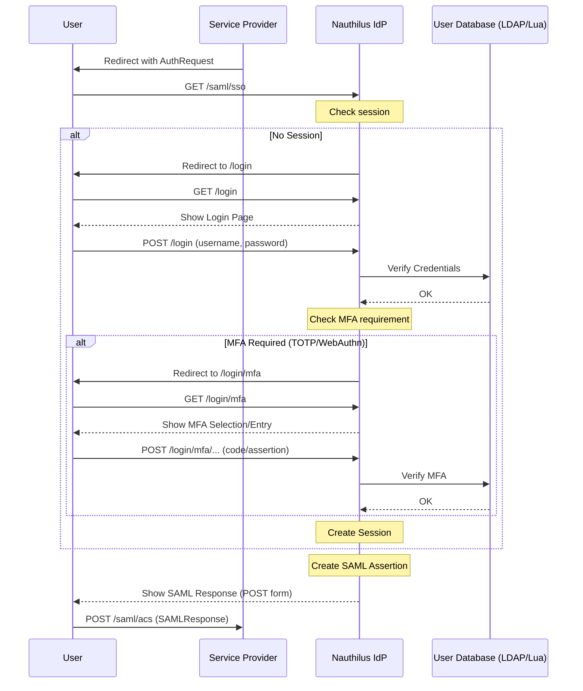

# SAML 2.0 IdP

Nauthilus includes a native SAML 2.0 Identity Provider.

## Authentication Flow

The following diagram shows the typical SAML2 Single Sign-On flow.


```mermaid
sequenceDiagram
    participant User
    participant SP as Service Provider
    participant Nauthilus as Nauthilus IdP
    participant Backend as User Database (LDAP/Lua)

    SP->>User: Redirect with AuthRequest
    User->>Nauthilus: GET /saml/sso
    Note over Nauthilus: Check session
    alt No Session
        Nauthilus->>User: Redirect to /login
        User->>Nauthilus: GET /login
        Nauthilus-->>User: Show Login Page
        User->>Nauthilus: POST /login (username, password)
        Nauthilus->>Backend: Verify Credentials
        Backend-->>Nauthilus: OK
        Note over Nauthilus: Check MFA requirement
        alt MFA Required (TOTP/WebAuthn)
            Nauthilus->>User: Redirect to /login/mfa
            User->>Nauthilus: GET /login/mfa
            Nauthilus-->>User: Show MFA Selection/Entry
            User->>Nauthilus: POST /login/mfa/... (code/assertion)
            Nauthilus->>Backend: Verify MFA
            Backend-->>Nauthilus: OK
        end
        Note over Nauthilus: Create Session
    end
    Note over Nauthilus: Create SAML Assertion
    Nauthilus-->>User: Show SAML Response (POST form)
    User->>SP: POST /saml/acs (SAMLResponse)
```

This page covers endpoints, basic flows, and configuration.

## Endpoints

- Metadata: `GET /saml/metadata`
- SSO: `GET /saml/sso`
- SLO: `GET /saml/slo`

Notes:
- Current SLO support terminates the local session; front-/back-channel SLO with SPs depends on client/SP support.

## Configuration

Top-level section: `idp.saml2`

```yaml
idp:
  saml2:
    enabled: true
    entity_id: "https://idp.example.com/saml"

    # Either inline key/cert or via files
    cert_file: "/etc/nauthilus/saml/idp.pem"
    key_file: "/etc/nauthilus/saml/idp.key"

    # Defaults
    signature_method: "http://www.w3.org/2001/04/xmldsig-more#rsa-sha256"
    default_expire_time: 1h
    name_id_format: "urn:oasis:names:tc:SAML:2.0:nameid-format:persistent"
    slo:
      enabled: true
      front_channel_enabled: true
      back_channel_enabled: false
      request_timeout: 3s
      max_participants: 64
      back_channel_max_retries: 1

    # Service Providers
    service_providers:
      - name: "Example SP"
        entity_id: "https://sp.example.com/metadata"
        acs_url: "https://sp.example.com/saml/acs"
        slo_url: "https://sp.example.com/saml/slo"
        slo_back_channel_url: "https://sp.example.com/saml/slo/backchannel"
        authn_requests_signed: true
        cert_file: "/etc/nauthilus/saml/sp.pem"
        allowed_attributes: ["mail", "cn", "uid", "memberOf"]
        require_mfa: ["webauthn"]
        supported_mfa: ["totp", "webauthn", "recovery_codes"]
        delayed_response: false
        logout_redirect_uri: "https://sp.example.com/"
```

### Settings reference

- `enabled` (bool): Enable/disable the SAML IdP
- `entity_id` (string): The IdP EntityID published in metadata
- `cert`/`cert_file` and `key`/`key_file`: X.509 certificate and private key for signing
- `signature_method` (string): XMLDSig algorithm identifier URI (not an HTTP endpoint URL). Currently supported value:
  - `http://www.w3.org/2001/04/xmldsig-more#rsa-sha256`
- `default_expire_time` (duration): ID/Assertion validity
- `name_id_format` (string): Default NameIDFormat (persistent recommended)
- `slo` (object): protocol-aware Single Logout fanout behavior
  - `enabled` (bool, default: `true`)
  - `front_channel_enabled` (bool, default: `true`)
  - `back_channel_enabled` (bool, default: `false`)
  - `request_timeout` (duration, default: `3s`)
  - `max_participants` (int, default: `64`)
  - `back_channel_max_retries` (int, default: `1`; `0` keeps default, negative clamps to `0`)
- `service_providers` (list of SAML2ServiceProvider):
  - `name` (string): Human-readable name for the service provider
  - `entity_id` (required), `acs_url` (required), `slo_url` (optional), `slo_back_channel_url` (optional)
  - `cert` or `cert_file`: SP certificate (inline or file path) for signature verification
  - `authn_requests_signed` (bool): if `true`, AuthnRequests from this SP must be signed and `cert`/`cert_file` must be configured with a valid PEM certificate
  - `allowed_attributes` (list of strings): Restrict which attributes are released to this SP. If empty, all attributes are allowed.
  - `require_mfa` / `supported_mfa` (lists): MFA policy per SP (`totp`, `webauthn`, `recovery_codes`)
  - `delayed_response` (bool)
  - `logout_redirect_uri` (string)

## MFA and Consent

- SAML flows leverage the same integrated login, consent, and MFA (TOTP/WebAuthn) UI as OIDC.
- If both `require_mfa` and `supported_mfa` are set, `require_mfa` must be a subset of `supported_mfa`.
- If `slo.enabled` is `false`, front-/back-channel toggles are effectively disabled.

## Metadata

- The metadata endpoint exposes signing keys and SSO/SLO bindings.
