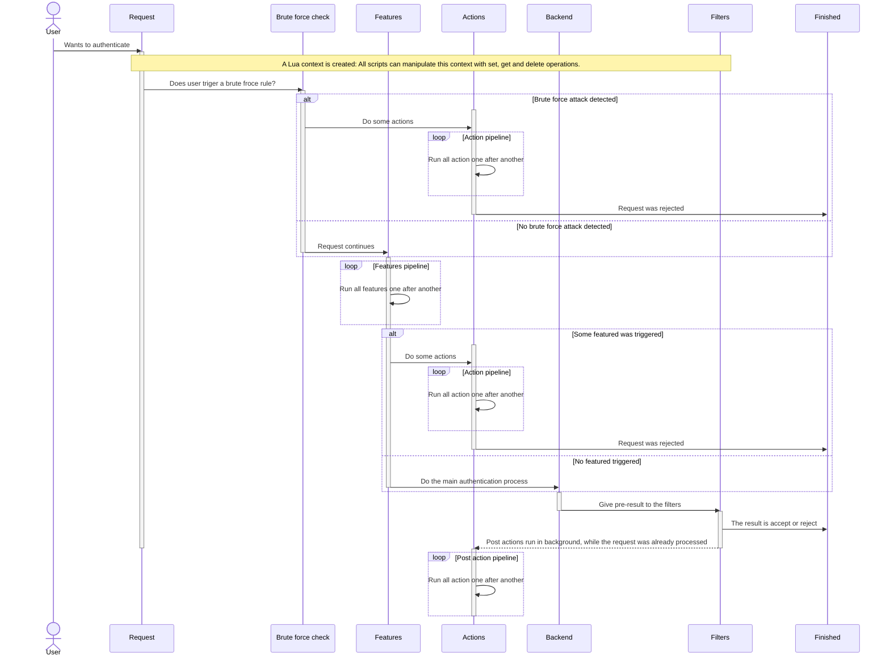

# Lua Support

Nauthilus has Lua 5.1 support in all areas of the service. To understand the interfaces, you must first get an idea of
what happens with an incoming authentication request.

<!-- TOC -->
* [Lua Support](#lua-support)
  * [Authentication workflow](#authentication-workflow)
  * [Additional things to know](#additional-things-to-know)
    * [While runtime...](#while-runtime)
  * [Configuration](#configuration)
  * [Lua components](#lua-components)
  * [Lua libraries](#lua-libraries)
    * [Actions](#actions)
    * [Features](#features)
    * [Lua backend](#lua-backend)
    * [Filters](#filters)
    * [Post actions](#post-actions)
  * [Required functions and constants](#required-functions-and-constants)
  * [Common request fields for all Lua scripts](#common-request-fields-for-all-lua-scripts)
    * [Features](#features-1)
      * [Constants for the returned result](#constants-for-the-returned-result)
    * [Request fields](#request-fields)
    * [Filters](#filters-1)
      * [Constants for the returned result](#constants-for-the-returned-result-1)
    * [Request fields](#request-fields-1)
    * [Actions (including post)](#actions-including-post)
      * [Constants for the returned result](#constants-for-the-returned-result-2)
    * [Request fields](#request-fields-2)
    * [Lua Backend](#lua-backend-1)
      * [Constants for the returned result](#constants-for-the-returned-result-3)
    * [Request fields](#request-fields-3)
    * [Function nauthilus\_backend\_verify\_password request fields](#function-nauthilus_backend_verify_password-request-fields)
    * [Function nauthilus\_backend\_list\_accounts request fields](#function-nauthilus_backend_list_accounts-request-fields)
      * [Function nauthilus\_backend\_add\_totp request fields](#function-nauthilus_backend_add_totp-request-fields)
  * [UserData object backend\_result](#userdata-object-backend_result)
    * [backend](#backend)
    * [filters](#filters-2)
    * [Example usage for nauthilus\_backend\_result](#example-usage-for-nauthilus_backend_result)
      * [Endpoints /api/v1/mail/dovecot, /api/v1/generic/user and /api/v1/generic/json](#endpoints-apiv1maildovecot-apiv1genericuser-and-apiv1genericjson)
* [API](#api)
  * [Context](#context)
    * [nauthilus\_context.context\_set](#nauthilus_contextcontext_set)
    * [nauthilus\_context.context\_get](#nauthilus_contextcontext_get)
    * [nauthilus\_context.context\_delete](#nauthilus_contextcontext_delete)
  * [Redis](#redis)
    * [nauthilus\_redis.redis\_set](#nauthilus_redisredis_set)
    * [nauthilus\_redis.redis\_incr](#nauthilus_redisredis_incr)
    * [nauthilus\_redis.redis\_get](#nauthilus_redisredis_get)
    * [nauthilus\_redis.redis\_expire](#nauthilus_redisredis_expire)
    * [nauthilus\_redis.redis\_del](#nauthilus_redisredis_del)
    * [nauthilus\_redis.redis\_rename](#nauthilus_redisredis_rename)
    * [nauthilus\_redis.redis\_hget](#nauthilus_redisredis_hget)
    * [nauthilus\_redis.redis\_hset](#nauthilus_redisredis_hset)
    * [nauthilus\_redis.redis\_hdel](#nauthilus_redisredis_hdel)
    * [nauthilus\_redis.redis\_hlen](#nauthilus_redisredis_hlen)
    * [nauthilus\_redis.redis\_hgetall](#nauthilus_redisredis_hgetall)
    * [nauthilus\_redis.redis\_hincrby](#nauthilus_redisredis_hincrby)
    * [nauthilus\_redis.redis\_hincrbyfloat](#nauthilus_redisredis_hincrbyfloat)
    * [nauthilus\_redis.redis\_hexists](#nauthilus_redisredis_hexists)
    * [nauthilus\_redis.redis\_sadd](#nauthilus_redisredis_sadd)
    * [nauthilus\_redis.redis\_sismember](#nauthilus_redisredis_sismember)
    * [nauthilus\_redis.redis\_smembers](#nauthilus_redisredis_smembers)
    * [nauthilus\_redis.redis\_srem](#nauthilus_redisredis_srem)
    * [nauthilus\_redis.redis\_scard](#nauthilus_redisredis_scard)
  * [HTTP request](#http-request)
    * [nauthilus\_http.get\_all\_http\_request\_headers](#nauthilus_httpget_all_http_request_headers)
    * [nauthilus\_http\_request.get\_http\_request\_header](#nauthilus_http_requestget_http_request_header)
    * [nauthilus\_http\_request.get\_http\_request\_body](#nauthilus_http_requestget_http_request_body)
  * [Generic Lua functions](#generic-lua-functions)
    * [nauthilus\_builtin.status\_message\_set](#nauthilus_builtinstatus_message_set)
    * [nauthilu\_builtin.custom\_log\_add](#nauthilu_builtincustom_log_add)
  * [Feature backend\_server\_monitoring enabled](#feature-backend_server_monitoring-enabled)
    * [nauthilus\_backend.get\_backend\_servers](#nauthilus_backendget_backend_servers)
    * [nauthilus\_backend.select\_backend\_server and nauthilus\_backend.apply\_backend\_result](#nauthilus_backendselect_backend_server-and-nauthilus_backendapply_backend_result)
    * [nauthilus\_backend.remove\_from\_backend\_result](#nauthilus_backendremove_from_backend_result)
    * [nauthilus\_backend.check\_backend\_connection](#nauthilus_backendcheck_backend_connection)
  * [Backend LDAP used](#backend-ldap-used)
    * [nauthilus\_ldap.ldap\_search](#nauthilus_ldapldap_search)
  * [Password](#password)
    * [nauthilus\_password.compare\_passwords](#nauthilus_passwordcompare_passwords)
    * [nauthilus\_password.check\_password\_policy](#nauthilus_passwordcheck_password_policy)
  * [Mail](#mail)
    * [nauthilus\_mail.send\_mail](#nauthilus_mailsend_mail)
  * [Misc](#misc)
    * [nauthilus\_misc.get\_country\_name](#nauthilus_miscget_country_name)
    * [nauthilus\_misc.wait\_random](#nauthilus_miscwait_random)
  * [Additional notes](#additional-notes)
<!-- TOC -->

## Authentication workflow

An incoming authentication request first enters the **brute\_force** check. After that it continues with the **features** 
pipeline. After that has past, it continues to process the request in a **password backend**. When the final result for the 
request was obtained, it passes **filters**. 

Filters may change the backend result in one or the other way (accepting a formely rejected message or vice versa). This 
is especially useful for other remote services that can influence the authentication process. 

After all this has finished, it is possible to do some **post actions**, which are run independent 
of all other steps in the whole pipeline and therefore can not influence the final result anymore. 

In the following sequence diagram you can see the processing of the request in more detail.


## Additional things to know

When starting the server, it is possible to call an init script, which may be used to register prometheus elements, start
connection tracker or define custom redis pools. The latter is interesting, if you prefer using other redis servers for all
your custom Lua scripts.

### While runtime...

When an incoming authentication request is started, a Lua context is created.

All parts of a request share that common request context. Lua scripts can set arbitrary data in the context and read/delete
things from there. 

Lua scripts can modify the final log line by adding key-value pairs from each script.

## Configuration

For the configuration, please have a look for the [configuration file](configuration-file.md) document.

## Lua components

Each component does provide a set of global functions, constants, ... and requires a well-defined response from each request.

Every Lua script that has been configured, is pre-compiled and kept in memory for future use. To make script changes, you
must reload the service.

## Lua libraries

Nauthilus does not automatically preload Lua modules. Therefor, a dynamic loader has been written, which must be run before
requireing a module.

Example:

```lua
dynamic_loader("foo")
local foo = require("foo")
```

A module is preloaded for a single Lua state, which is shared accross all scripts that make use of it. Let's say, there
have been defined three filter scripts and 5 post-action scripts, then each class (filter and post-action) share the same
Lua state and receive the same preloaded modules.

Modules are never preloaded twice.

This is the list of modules that are currently available:

| Loader name               | Description                                        |
|---------------------------|----------------------------------------------------|
| nauthilus_mail            | E-Mail functions                                   |
| nauthilus_password        | Password compare and validation functions          |
| nauthilus_redis           | Redis related functions                            |
| nauthilus_misc            | Country code and sleep functions                   |
| nauthilus_context         | Global Lua context accross all States in Nauthilus |
| nauthilus_ldap            | LDAP related functions                             |
| nauthilus_backend         | Backend related functions                          |
| nauthilus_http_request    | HTTP request header functions                      |
| nauthilus_gluacrypto      | gluacrpyto project on Github                       |
| nauthilus_gll_plugin      | gopher-lua-libs project on Github                  |
| nauthilus_gll_argparse    | gopher-lua-libs project on Github                  |
| nauthilus_gll_base64      | gopher-lua-libs project on Github                  |
| nauthilus_gll_cert_util   | gopher-lua-libs project on Github                  |
| nauthilus_gll_chef        | gopher-lua-libs project on Github                  |
| nauthilus_gll_cloudwatch  | gopher-lua-libs project on Github                  |
| nauthilus_gll_cmd         | gopher-lua-libs project on Github                  |
| nauthilus_gll_crypto      | gopher-lua-libs project on Github                  |
| nauthilus_gll_db          | gopher-lua-libs project on Github                  |
| nauthilus_gll_filepath    | gopher-lua-libs project on Github                  |
| nauthilus_gll_goos        | gopher-lua-libs project on Github                  |
| nauthilus_gll_http        | gopher-lua-libs project on Github                  |
| nauthilus_gll_humanize    | gopher-lua-libs project on Github                  |
| nauthilus_gll_inspect     | gopher-lua-libs project on Github                  |
| nauthilus_gll_ioutil      | gopher-lua-libs project on Github                  |
| nauthilus_gll_json        | gopher-lua-libs project on Github                  |
| nauthilus_gll_log         | gopher-lua-libs project on Github                  |
| nauthilus_gll_pb          | gopher-lua-libs project on Github                  |
| nauthilus_gll_pprof       | gopher-lua-libs project on Github                  |
| nauthilus_gll_prometheus  | gopher-lua-libs project on Github                  |
| nauthilus_gll_regexp      | gopher-lua-libs project on Github                  |
| nauthilus_gll_runtime     | gopher-lua-libs project on Github                  |
| nauthilus_gll_shellescape | gopher-lua-libs project on Github                  |
| nauthilus_gll_stats       | gopher-lua-libs project on Github                  |
| nauthilus_gll_storage     | gopher-lua-libs project on Github                  |
| nauthilus_gll_strings     | gopher-lua-libs project on Github                  |
| nauthilus_gll_tac         | gopher-lua-libs project on Github                  |
| nauthilus_gll_tcp         | gopher-lua-libs project on Github                  |
| nauthilus_gll_telegram    | gopher-lua-libs project on Github                  |
| nauthilus_gll_template    | gopher-lua-libs project on Github                  |
| nauthilus_gll_time        | gopher-lua-libs project on Github                  |
| nauthilus_gll_xmlpath     | gopher-lua-libs project on Github                  |
| nauthilus_gll_yaml        | gopher-lua-libs project on Github                  |
| nauthilus_gll_zabbix      | gopher-lua-libs project on Github                  |

Example:

```lua
dynamic_loader("nauthilus_redis")
local nauthilus_redis = require("nauthilus_redis")

dynamic_loader("nauthilus_context")
local nauthilus_builtin.context = require("nauthilus_context")

dynamic_loader("nauthilus_gluacrypto")
local crypto = require("crypto")

dynamic_loader("nauthilus_gll_db")
local db = require("db")

dynamic_loader("nauthilus_gll_time")
local time = require("time")
```

### Actions

Whenever a brute froce attack is recognized, **action**s may be called. The request will wait until all requests have 
finished. Actions are processed by a central action worker. No results are returned to the regular request, so actions
in general do their own logging!

Also, **features** may call actions if they were triggered. The request is waiting to finish all actions by the worker 
process.

### Features

Besides the well known features geoip, rbl, tls\_encryption and relay\_domains, a new feature has been integrated: lua. This
feature is processed before all other features (in fact, you might replace all these features with pure Lua...). Lua-features 
are run one after another. As soon as a feature has triggered, the request will reject the authentication process.
Furthermore, Lua features can set a flag to bypass all built-in features.

### Lua backend

A new backend has been implemented. It can be used for all features that Nauthilus currently supports: Checking passwords,
running different modes (no-auth, list-accounts), adding TOTP...

The backend can accept a request or reject it. It has full access to all meta information that are delivered from the
incoming request.

### Filters

There may exist remote services that may be contacted after the main backend authentication proccess returned its first  
result. Think of something like GeoIP service or some IP white/blacklisting. Even a request that might have authenticated
correctly may be rejected to a policy violation from such a service. Therefor filters have the power to overwrite the
result from a backend.

You can also use filters to retrieve additional information from databases or LDAP and add additional attributes to the remaining result.
This is useful for setups, where Nauthilus may also take the role of a Dovecot proxy. Users may get routed to different
mail stores upon successful authentication. For this, you may retrieve the current backend server list with servers that have been
checked as being alive with the **backend\_server\_monitoring** feature and select nominate it for the current client request.

:::info
Filters never affect caching! This is important, because otherwise valid credentials might result in storing them in the
negative password cache or vice versa for invalid credentials.
:::

:::warning
You always have to deal with the "request.authenticated" flag! If you don't care enough, you might acidentially reject
legitimate authenticated users or allow bad guys.
:::

### Post actions

Post actions are actions, which run after the request hast come to its final result. Its main purpose is to start some
automated things like doing statistics stuff, sending messages to operators or anything else that does not require fast
instant processing.

As an example have a look at the telegram script. Lua scripts in earlier stages of the process may provide some 
information by using the Lua context. The telegram script may pick up these information and decide to send out some 
notifications to an operator channel.

## Required functions and constants

Every Lua script must provide a pre-defined Lua function with a request parameter. Concerning the actual script, there is
a requried return statement.

Nauthilus will look for these functions and parses the results.

## Common request fields for all Lua scripts

The following request fields are supported

| Name                     | Type   | Precense | Additional info                                                   |
|--------------------------|--------|----------|-------------------------------------------------------------------|
| debug                    | bool   | always   | -                                                                 |
| repeating                | bool   | maybe    | -                                                                 |
| user_found               | bool   | maybe    | -                                                                 |
| authenticated            | bool   | maybe    | -                                                                 |
| no_auth                  | bool   | always   | true, if the reuqest is used to retrieve user information         |
| service                  | string | always   | Nauthilus endpoint like "dovecot" or "nginx"                      |
| session                  | string | always   | -                                                                 |
| client\_ip               | string | always   | -                                                                 |
| client\_port             | string | always   | -                                                                 |
| client_net               | string | maybe    | Available in conjunction with brute-force-actions                 |
| client\_id               | string | maybe    | -                                                                 |
| user\_agent              | string | maybe    | -                                                                 |
| local\_ip                | string | always   | -                                                                 |
| local\_port              | string | always   | -                                                                 |
| username                 | string | always   | -                                                                 |
| account                  | string | maybe    | Filter and post actions                                           |
| unique\_user\_id         | string | maybe    | Used with OIDC subject                                            |
| display\_name            | string | maybe    | -                                                                 |
| password                 | string | always   | -                                                                 |
| protocol                 | string | always   | -                                                                 |
| brute\_force\_bucket     | string | maybe    | Available in conjunction with brute-force-actions                 |
| feature                  | string | maybe    | In actions, if a feature has triggered                            |
| status\_message          | string | always   | Current status message returned to client, if auth request failed |
| ssl                      | string | maybe    | HAproxy: %[ssl\_fc]                                               |
| ssl\_session\_id         | string | maybe    | HAproxy: %[ssl\_fc\_session\_id,hex]                              |
| ssl\_client\_verify      | string | maybe    | HAproxy: %[ssl\_c\_verify]                                        |
| ssl\_client\_dn          | string | maybe    | HAproxy: %\{+Q\}[ssl\_c\_s\_dn]                                   |
| ssl\_client\_cn          | string | maybe    | HAproxy: %\{+Q\}[ssl\_c\_s\_dn(cn)]                               |
| ssl\_issuer              | string | maybe    | HAproxy: %\{+Q\}[ssl\_c\_i\_dn]                                   |
| ssl\_client\_not\_before | string | maybe    | HAproxy: %\{+Q\}[ssl\_c\_notbefore]                               |
| ssl\_client\_not\_after  | string | maybe    | HAproxy: %\{+Q\}[ssl\_c\_notafter]                                |
| ssl\_subject\_dn         | string | maybe    | HAproxy: %\{+Q\}[ssl\_c\_s\_dn]                                   |
| ssl\_issuer\_dn          | string | maybe    | HAproxy: %\{+Q\}[ssl\_c\_i\_dn]                                   |
| ssl\_client\_subject\_dn | string | maybe    | HAproxy: %\{+Q\}[ssl\_c\_s\_dn]                                   |
| ssl\_client\_issuer\_dn  | string | maybe    | HAproxy: %\{+Q\}[ssl\_c\_i\_dn]                                   |
| ssl\_protocol            | string | maybe    | HAproxy: %[ssl\_fc\_protocol]                                     |
| ssl\_cipher              | string | maybe    | HAproxy: %[ssl\_fc\_cipher]                                       |

:::note
TLS-related values may be retrieved from Nginx and as a fallback tried to be retrieved from HAproxy headers.
:::

:::tip
It is always a good idea to check the value of a request field, before using it.
:::

### Features

A Lua feature script must provide the following function:

```lua
---@param request table
---@return number, number, number
function nauthilus_call_feature(request)
  return trigger, skip_flag, failure_info -- See details below
end
```

:::important
It must return three values: The trigger state, a flag that indicates, if other features shall be skipped and a third value
which is an indicator for errors that occurred in the script itself.
:::

#### Constants for the returned result

| Constant                                | Meaning                                                         | Value | Category      |
|-----------------------------------------|-----------------------------------------------------------------|-------|---------------|
| nauthilus_builtin.FEATURE\_TRIGGER\_NO  | The feature has not been triggered                              | 0     | trigger       |
| nauthilus_builtin.FEATURE\_TRIGGER\_YES | The feature has been triggered and the request must be rejected | 1     | trigger       |
| nauthilus_builtin.FEATURES\_ABORT\_NO   | Process other built-in features                                 | 0     | skip\_flag    |
| nauthilus_builtin.FEATURES\_ABORT\_YES  | After finishing the script, skip all other built-in features    | 1     | skip\_flag    |
| nauthilus_builtin.FEATURE\_RESULT\_OK   | The script finished without errors                              | 0     | failure\_info |
| nauthilus_builtin.FEATURE\_RESULT\_FAIL | Something went wrong while executing the script                 | 1     | failure\_info |

### Request fields

Only common request fields are present.

### Filters

A Lua filter script must provide the following function:

```lua
---@param request table
---@return number, number, number
function nauthilus_call_filter(request)
  if request.authenticated then
    -- do something
  end
  
  return filter_action, failure_info -- See details below
end
```

:::important
It must return three values: The trigger state, a flag that indicates, if other features shall be skipped and a third value
which is an indicator for errors that occurred in the script itself.
:::

#### Constants for the returned result

| Constant                                 | Meaning                                         | Value | Category       |
|------------------------------------------|-------------------------------------------------|-------|----------------|
| nauthilus_builtin.FILTER\_ACTION\_ACCEPT | The request must be accepted                    | 0     | filter\_action |
| nauthilus_builtin.FILTER\_ACTION\_REJECT | The request has to be rejected                  | 1     | filter\_action |
| nauthilus_builtin.FILTER\_RESULT\_OK     | The script finished without errors              | 0     | filter\_info   |
| nauthilus_builtin.FILTER\_RESULT\_FAIL   | Something went wrong while executing the script | 1     | filter\_info   |

### Request fields

Only common request fields are present.

### Actions (including post)

A Lua action script must provide the following function:

```lua
---@param request table
---@return number
function nauthilus_call_action(request)
  if request.no_auth then
    -- Example post action: Store request information in database
  end

  return failure_info -- See details below
end
```

:::important
Actions must return the script status constant.
:::

#### Constants for the returned result

| Constant                               | Meaning                            | Value | Category      |
|----------------------------------------|------------------------------------|-------|---------------|
| nauthilus_builtin.ACTION\_RESULT\_OK   | The script finished without errors | 0     | failure\_info |
| nauthilus_builtin.ACTION\_RESULT\_FAIL | The script finished with errors    | 1     | failure\_info |

### Request fields

Only common request fields are available.

### Lua Backend

The Lua backend script must provide the following function:

```lua
---@param request table
---@return number, userdata
function nauthilus_backend_verify_password(request)
  local backend_result_object = backend_result:new()
  -- Do something with backend_result_object
  
  return failure_info, backend_result_object -- See details below
end
```

For user account listing, the following function is required:

```lua
---@param request table
------@return number, table
function nauthilus_backend_list_accounts(request)
  local accounts = {}
  
  return failure_info, accounts -- See details below
end
```

If you plan on adding TOTP-keys for your users, you must provide the follwing function:

```lua
---@param request table
---@return number
function nauthilus_backend_add_totp(request)
  return failure_info -- See details below
end
```

:::important
The backend must return the result status constant and a backend result object
:::

#### Constants for the returned result

| Constant                                | Meaning                            | Value | Category      |
|-----------------------------------------|------------------------------------|-------|---------------|
| nauthilus_builtin.BACKEND\_RESULT\_OK   | The script finished without errors | 0     | failure\_info |
| nauthilus_builtin.BACKEND\_RESULT\_FAIL | The script finished with errors    | 1     | failure\_info |

### Request fields

### Function nauthilus\_backend\_verify\_password request fields

Only common request fields are used.

### Function nauthilus\_backend\_list\_accounts request fields

Only "debug" and "session" from the common requests are available.

#### Function nauthilus\_backend\_add\_totp request fields

Only "debug" and "session" from the common requests as well as "totp\_secret" (string)  are available.

## UserData object backend\_result

The **nauthilus\_backend\_result** object can be initialized in the Lua backend and in Lua filters. The following methods exist:

### backend

| Name                    | Meaning                                                                                      |
|-------------------------|----------------------------------------------------------------------------------------------|
| authenticated           | Set or get the authentication status                                                         |
| user\_found             | Set or get the user found flag which indicated, if the backend found the user                |
| account\_field          | Set or get the account field name, which must have been added to a list of result attributes |
| totp\_secret\_field     | Set or get the TOTP secret field name, which must have been added to the result attributes   |
| totp\_recovery\_field   | Not yet implemented                                                                          |
| unique\_user\_id\_field | Set or get the unique user id field, which must have been added to the result attributes     |
| display\_name\_field    | Set or get the display name field, which must have been added to the result attributes       |
| attributes              | Set or get the result attributes as a Lua table                                              |

### filters

Filters only have an "attributes" method. While Lua backends do return a **nauthlus\_backend\_result** directly, filters can only
apply it with a Lua function called "nauthilus_backend.apply\_backend\_result(backend\_result\_object)".

Attributes can not overwrite existing attributes!

### Example usage for nauthilus\_backend\_result

```lua
local attributes = {}
attributes["account"] = "bob"

local b = nauthilus_backend_result.new()
b:attributes(attributes) -- Add the table
b:account_field("account") -- Attributes contain a key "account" for the account field
b:authenticated(true) -- User is authenticated
b:user_found(true) -- The user was found
```

#### Endpoints /api/v1/mail/dovecot, /api/v1/generic/user and /api/v1/generic/json

"attributes" represent a common result store for a backend query. All fields that have been set by \*\_field methods will be
used for further internal processing, while all other attributes will be converted to HTTP-response-headers, which will be
sent back to the client application that talked to Nauthilus. These headeres will be prefixed with **X-Nauthilus-**.

For the generic endpoints, "attributes" will bew returned in the JSON respone.

# API

## Context

```lua
dynamic_loader("nauthilus_context")
local nauthilus_context = require("nauthilus_context")
```

### nauthilus\_context.context\_set
Add a value to the shared Lua context. Values can be strings, numbers, booleans and tables. You can not add functions here.

```lua
dynamic_loader("nauthilus_context")
local nauthilus_context = require("nauthilus_context")

nauthilus_context.context_set("key", value)
```

Get a Lua context value:

### nauthilus\_context.context\_get

```lua
dynamic_loader("nauthilus_context")
local nauthilus_context = require("nauthilus_context")

local value = nauthilus_context.context_get("key")
```

If there is no result, nil is returned.

### nauthilus\_context.context\_delete

To delete a key/value pair from the Lua context, use the following function:

```lua
dynamic_loader("nauthilus_context")
local nauthilus_context = require("nauthilus_context")

nauthilus_context.context_delete("key")
```

## Redis

There is basic Redis support in Nauthilus. Most of the time it should be enough to use simple Redis keys and string values
as arguments. Type conversion can be done within Lua itself.

```lua
dynamic_loader("nauthilus_redis")
local nauthilus_redis = require("nauthilus_redis")
```

## Redis custom pools

In the init script of the Nauthilus server, you can define custom pools. For each Redis command, the first parameter is
either a string called "default" or a connection handle. The "default" will use Redis servers from the Nauthilus server itself.

### How to register a new pool?

Example of a sentinel custom pool:

```lua
local _, err_redis_reg = nauthilus_redis.register_redis_pool("my_custom_name", "sentinel", {
            addresses = { "redis-sentinel-sentinel.ot-operators:26379" },
            master_name = "myMaster",
            password = "",
            db = 3,
            pool_size = 10,
            min_idle_conns = 1,
            tls_enabled = false
        })
```

To get the handle of this pool, do the following in you Lua scripts:

```lua
local custom_pool, err_redis_client = nauthilus_redis.get_redis_connection("my_custom_name")
```

Now you can use **custom\_pool** as the first argument to each Redis function.

You can define as many pools as you like. Currently supported is "standalone", "sentinel" and "cluster".

Documentation for the parameters is TODO.

In the following, I will use the name "handle" for a pool handler.

## Functions

### nauthilus\_redis.redis\_set

You can store a value in Redis with the following function:

```lua
dynamic_loader("nauthilus_redis")
local nauthilus_redis = require("nauthilus_redis")

local result, error = nauthilus_redis.redis_set(handle, "key", "value", 3600)
```

The expiration value is optional.

If anything went fine, "OK" is returned as **result**. In cases of errors, the **result** equals nil and a string is returned as **error**.

### nauthilus\_redis.redis\_incr

You can increment a value in Redis with the following function:

```lua
dynamic_loader("nauthilus_redis")
local nauthilus_redis = require("nauthilus_redis")

local number, error = nauthilus_redis.redis_incr(handle, "key")
```

If anything went fine, the current **number** is returned. In cases of an **error**, number equals nil and a string is returned.

### nauthilus\_redis.redis\_get

To retrieve a value from Redis use the following function:

```lua
dynamic_loader("nauthilus_redis")
local nauthilus_redis = require("nauthilus_redis")

local result, error = nauthilus_redis.redis_get(handle, "key")
```

If anything went fine, the returned value is stored in **result**. In cases of errors, the **result** equals nil and a string is returned to **error*.

### nauthilus\_redis.redis\_expire

A Redis key can have an expiration time in seconds. Use the following function to achieve this goal:

```lua
dynamic_loader("nauthilus_redis")
local nauthilus_redis = require("nauthilus_redis")

local result, error = nauthilus_redis.redis_expire(handle, "key")
```

If anything went fine, "OK" is returned as **result**. In cases of errors, the **result** equals nil and a string is returned as **error**.

### nauthilus\_redis.redis\_del

To delete a Redis key, use the following function:

```lua
dynamic_loader("nauthilus_redis")
local nauthilus_redis = require("nauthilus_redis")

local result, error = nauthilus_redis.redis_del(handle, "key")
```
If anything went fine, "OK" is returned as **result**. In cases of errors, the **result** equals nil and a string is returned as **error**.

### nauthilus\_redis.redis\_rename

Rename a Redis key

```lua
dynamic_loader("nauthilus_redis")
local nauthilus_redis = require("nauthilus_redis")

local oldkey = "abc"
local newkey = "def"

local result, err = nauthilus_redis.redis_rename(handle, oldkey, newkey)
```

### nauthilus\_redis.redis\_hget

Get a value from a Redis hash map

```lua
dynamic_loader("nauthilus_redis")
local nauthilus_redis = require("nauthilus_redis")

local redis_key = "some_key"
local already_sent_mail, err_redis_hget2 = nauthilus_redis.redis_hget(handle, redis_key, "send_mail")
```

### nauthilus\_redis.redis\_hset

Set a value in a Redis hash map

```lua
dynamic_loader("nauthilus_redis")
local nauthilus_redis = require("nauthilus_redis")

local redis_key = "some_key"
local _, err_redis_hset = nauthilus_redis.redis_hset(handle, redis_key, "send_mail", 1)
```

### nauthilus\_redis.redis\_hdel

Delete a key from a Redis hash map

```lua
dynamic_loader("nauthilus_redis")
local nauthilus_redis = require("nauthilus_redis")

local result = {}
result.dovecot_session = "123"

local redis_key = "some_key"
local deleted, err_redis_hdel = nauthilus_redis.redis_hdel(handle, redis_key, result.dovecot_session)
```

### nauthilus\_redis.redis\_hlen

Get the number of entries in a hash map

```lua
dynamic_loader("nauthilus_redis")
local nauthilus_redis = require("nauthilus_redis")

local redis_key = "some_key"
local length, err_redis_hlen = nauthilus_redis.redis_hlen(handle, redis_key)
```

### nauthilus\_redis.redis\_hgetall

Get all values from a Redis hash map

```lua
dynamic_loader("nauthilus_redis")
local nauthilus_redis = require("nauthilus_redis")

local redis_key = "some_key"
local all_sessions, err_redis_hgetall = nauthilus_redis.redis_hgetall(handle, redis_key)
```

### nauthilus\_redis.redis\_hincrby

Increament the value (integer) of a Redis hash map key

```lua
dynamic_loader("nauthilus_redis")
local nauthilus_redis = require("nauthilus_redis")

local key = "some_key"
local field = "some_field"
local increment = 1

local result, err = nauthilus_redis.redis_hincrby(handle, key, field, increment)
```

### nauthilus\_redis.redis\_hincrbyfloat

Increament the value (float) of a Redis hash map key

```lua
dynamic_loader("nauthilus_redis")
local nauthilus_redis = require("nauthilus_redis")

local key = "some_key"
local field = "some_field"
local increment = 1.3

local result, err = nauthilus_redis.redis_hincrbyfloat(handle, key, field, increment)
```

### nauthilus\_redis.redis\_hexists

```lua
dynamic_loader("nauthilus_redis")
local nauthilus_redis = require("nauthilus_redis")

local key = "some_key"
local field = "some_field"

local result, err = nauthilus_redis.redis_hexists(handle, key, field)
```

### nauthilus\_redis.redis\_sadd

Add a value to a Redis set

```lua
dynamic_loader("nauthilus_redis")
local nauthilus_redis = require("nauthilus_redis")

local key = "some_key"
local value = "some_value"

local result, err = nauthilus_redis.redis_sadd(handle, key, value)
```

### nauthilus\_redis.redis\_sismember

Check, if a value is a mamber of a Redis set

```lua
dynamic_loader("nauthilus_redis")
local nauthilus_redis = require("nauthilus_redis")

local key = "some_key"
local value = "some_value"

local result, err = nauthilus_redis.redis_sismember(handle, key, value)
```
### nauthilus\_redis.redis\_smembers

Get all members from a Redis set

```lua
dynamic_loader("nauthilus_redis")
local nauthilus_redis = require("nauthilus_redis")

local key = "some_key"

local result, err = nauthilus_redis.redis_smembers(handle, key)
```

### nauthilus\_redis.redis\_srem

Remove a value from a Redis set

```lua
dynamic_loader("nauthilus_redis")
local nauthilus_redis = require("nauthilus_redis")

local key = "some_key"
local value = "some_value"

local result, err = nauthilus_redis.redis_srem(handle, key, value)
```

### nauthilus\_redis.redis\_scard

Return the number of values inside a Redis set

```lua
dynamic_loader("nauthilus_redis")
local nauthilus_redis = require("nauthilus_redis")

local key = "some_key"

local result, err = nauthilus_redis.redis_scard(handle, key)
```

TODO:

* redis_upload_script(handle, "Redis lua code...", "upload\_script\_name")
* redis_run_script(handle, "script or empty", "upload\_script\_name", \{ redis\_key \}, \{ args \})

## Prometheus

TODO:

* nauthilus_prometheus.create_gauge_vec
* increment_gauge
* decrement_gauge

* create_counter_vec
* increment_counter

* create_histogram_vec
* start_histogram_timer
* stop_timer

## PS net

TODO:

* nauthilus_psnet.register_connection_target

## HTTP request

```lua
dynamic_loader("nauthilus_http_request")
local nauthilus_http_request = require("nauthilus_http_request")
```
### nauthilus\_http.get\_all\_http\_request\_headers

It is possible to get the full set of HTTP request headers from a connecting service in Lua with the following function:

```lua
dynamic_loader("nauthilus_http_request")
local nauthilus_http_request = require("nauthilus_http_request")

local header_table = nauthilus_http_request.get_all_http_request_headers()

for header_key, header_value_table in pair(header_table) do
  print("header key: " .. header_key)
  for index, header_value in ipars(header_value_table) do
    print("header_value[" .. tostring(index) .. "]: " .. header_value)
  end
end 
```

As the example demonstrates, the result is a Lua table. The names for each header are stored in the key of this table, while the values
are also stored in a Lua table as list of strings.

### nauthilus\_http\_request.get\_http\_request\_header

Get a table of values for an HTTP request header.

```lua
dynamic_loader("nauthilus_http_request")
local nauthilus_http_request = require("nauthilus_http_request")

local header_table = nauthilus_http_request.get_http_request_headers("Content-Type")
```

### nauthilus\_http\_request.get\_http\_request\_body

Get the payload of an HTTP request  as a string.

```lua
dynamic_loader("nauthilus_http_request")
local nauthilus_http_request = require("nauthilus_http_request")

local body = nauthilus_http_request.get_http_request_body()
```

## Generic Lua functions

### nauthilus\_builtin.status\_message\_set

If a client request should be rejected, you can overwrite the returned status message with the following function:

```lua
nauthilus_builtin.status_message_set("Reject message here")
```

### nauthilu\_builtin.custom\_log\_add

This function adds key-value pairs to the result log. In case of **features*, **backend** and **filters**, the logs are all added to the final result log line.
In cases of **actions**, logging is appended to the **action** log line. The reason is simple: Actions may run asynchronous to the main request, which
might already have been closed.

You cann call this function as many times as you like. Even with same key-value pairs.

:::note
Logs can not be removed if once set!
:::

```lua
nauthilus_builtin.custom_log_add("key", value)
```

A **value** can be a string, number or boolean. Anything else is replaced as "UNSUPPORTED".

## Feature backend\_server\_monitoring enabled

If the feature **backend\_server\_monitoring is turned on, the following functions are available in **filters**:

```lua
dynamic_loader("nauthilus_backend")
local nauthilus_backend = require("nauthilus_backend")
```

### nauthilus\_backend.get\_backend\_servers

This function returns a **backend\_server** UserData object. 

Usage example:

```lua
dynamic_loader("nauthilus_backend")
local nauthilus_backend = require("nauthilus_backend")

local backend_servers = nauthilus_backend.get_backend_servers()

  ---@type table
  local valid_servers = {}

  for _, server in ipairs(backend_servers) do
    -- server.ip
    -- server.port
    -- server.protocol
    -- server.haproxy_v2
    -- server.tls
    -- You may select only HAproxy enabled backends... server.haproxy_v2
    table.insert(valid_servers, server)
  end
```

### nauthilus\_backend.select\_backend\_server and nauthilus\_backend.apply\_backend\_result

If you use the Nginx endpoint in NAuthilus, you can select a backend server with this function:

```lua
dynamic_loader("nauthilus_backend")
local nauthilus_backend = require("nauthilus_backend")

-- See nauthilus_backend.get_backend_servers above!
local server = valid_servers[some_number] -- You must define some logic on how to chose a backend server from the list

nauthilus_backend.select_backend_server(server.ip, server.port)
```

This will return the appropriate HTTP response header **Auth-Server** and **Auth-Port**

If you use a different endpoint, you may add the result to the attributes. In case of Dovecot this might look like this (untested):

```lua
dynamic_loader("nauthilus_backend")
local nauthilus_backend = require("nauthilus_backend")

local b = nauthilus_backend_result:new()
local attributes = {}
-- See nauthilus_backend.get_backend_servers above!
local server = valid_servers[some_number] -- You must define some logic on how to chose a backend server from the list

attributes["hostip"] = server.ip
b:attributes(attributes)
nauthilus_backend.apply_backend_result(b)
```

The result will be available as HTTP-response header **X-Nauthilus-Hostip** and can easily be parsed in a Dovecot Lua backend.

This example lacks persistent routing from users to backend servers. But it is a good starting point. Combine it with Redis or
SQL databases...

### nauthilus\_backend.remove\_from\_backend\_result

Remove attributes from the final result attributes

```lua
dynamic_loader("nauthilus_backend")
local nauthilus_backend = require("nauthilus_backend")

nauthilus_backend.remove_from_backend_result({ "Proxy-Host" })
```
:::note
Removeing attributes is always done before adding attributes (from apply\_backend\_result()-calls)
:::

This removes the Proxy-Host "header" attribute from the result.

### nauthilus\_backend.check\_backend\_connection

Before using a backend server, you could double-check with the following function:

```lua
dynamic_loader("nauthilus_backend")
local nauthilus_backend = require("nauthilus_backend")

local server_ip = "10.10.10.10"
local server_port = 993
local is_haproxy_v2 = true
local uses_tls = true

local error = nauthilus_backend.check_backend_connection(server_ip, server_port, is_haproxy_v2, uses_tls)
```
If anything went fine, **error** equals nil, else it stores a string with an error message.

:::warning
Normally you should not do this, as this will open a connection for each client  request!
:::

## Backend LDAP used

It is possible to send LDAP search requests to the main LDAP worker pool, if the **ldap** backend is enabled.

```lua
dynamic_loader("nauthilus_ldap")
local nauthilus_ldap = require("nauthilus_ldap")
```

### nauthilus\_ldap.ldap\_search

The LDAP search function receives a Lua table with the search request and returns a result table and an error stirng.

```lua
dynamic_loader("nauthilus_ldap")
local nauthilus_ldap = require("nauthilus_ldap")

local user = "bob"

local result, error = nauthilus_ldap.ldap_search({
  session = request.session, -- request: from the calling function
  basedn = "dc=acme,dc=com",
  filter = "(|(uniqueIdentifier=" .. user .. ")(uid=" .. user .. "))",
  attributes = {
    [1] = "some_attr1",
    [2] = "some_attr2",
  },
  scope = "sub"
})

local attributes = {} -- may be applied in a filter
if result then
  if type(result) == "table" then
    for key, value in pairs(result) do
      attributes[key] = value[1] -- LDAP single value example
    end
  end
end 
```

If anything went fine, the **result** contains a Lua table, where the key represents the LDAP attribute name and the values
are Lua tables with all values (multi value).

:::warning
LDAP search requests are blocking operations!
:::

## Password

```lua
dynamic_loader("nauthilus_password")
local nauthilus_password = require("nauthilus_password")
```

### nauthilus\_password.compare\_passwords

Compare two passwords. The first parameter is from a database. It is probably some kind of hash. The second argument is
a clear text password. The function detects the algorithm used by the first given parameter and creates the same for the second
parameter. If the result is equal, passwords are identical.

```lua
dynamic_loader("nauthilus_password")
local nauthilus_password = require("nauthilus_password")

local some_stored_pw = "password_from_db"
local some_password = "pw_given_by_user"

local match, err = nauthilus_password.compare_passwords(some_stored_pw, some_password)
```

### nauthilus\_password.check\_password\_policy

Check a given password against some password policy

```lua
dynamic_loader("nauthilus_password")
local nauthilus_password = require("nauthilus_password")

local password = "some_secret"

local ppolicy_ok = nauthilus_password.check_password_policy({
            min_length = 12,
            min_upper = 2,
            min_lower = 2,
            min_dumber = 1,
            min_special = 0,
        }, password)
```

## Mail

SMTP/LMTP related functions

```lua
dynamic_loader("nauthilus_mail")
local nauthilus_mail = require("nauthilus_mail")
```

### nauthilus\_mail.send\_mail

Send an email using SMTP or LMTP

```lua
dynamic_loader("nauthilus_mail")
local nauthilus_mail = require("nauthilus_mail")

dynamic_loader("nauthilus_gll_template")
local template = require("template")

local smtp_message = [[
Hallo,

Username: {{username}}
Account: {{account}}

...
]]

local tmpl_data = {
  username = request.username, -- Might come from the request object of the calling function
  account = request.account, -- Might come from the request object of the calling function
}

local mustache, err_tmpl = template.choose("mustache")

local err_email = nauthilus_mail.send_mail({
                    lmtp = true,
                    server = "10.0.0.24",
                    port = 24,
                    helo_name = "localhost.localdomain",
                    from = '"Sicherheitshinweis" <abuse@example.test>',
                    to = { request.account }, -- Might come from the request object of the calling function
                    subject = "Some subject",
                    body = mustache:render(smtp_message, tmpl_data),
                })
```

The table expects the following keys:

| Name      | Description                                            |
|-----------|--------------------------------------------------------|
| username  | Username for authentication (optional)                 |
| password  | Password for authentication (optional)                 |
| from      | The sender including an optional canonical name        |
| to        | A table of recipients                                  |
| server    | The address of the mail server                         |
| port      | The port number of the mail server                     |
| helo_name | The HELO/LHLO name                                     |
| subject   | The subject of the message                             |
| body      | The body of the message                                |
| tls       | Should the connection be secured aka SMTPS? true/false |
| starttls  | Use starttls command true/false                        |
| lmtp      | Do we send with LMTP (true) or SMTP (false)?           |

## Misc

```lua
dynamic_loader("nauthilus_misc")
local nauthilus_misc = require("nauthilus_misc")
```

### nauthilus\_misc.get\_country\_name

Get the human-friendly name of an ISO country code

```lua
dynamic_loader("nauthilus_misc")
local nauthilus_misc = require("nauthilus_misc")

local iso_code = "DE"

local country_name = nauthilus_misc.get_country_name(iso_code)
```
### nauthilus\_misc.wait\_random

Wait a raondom delay between a start and stop value in milliseconds

```lua
dynamic_loader("nauthilus_misc")
local nauthilus_misc = require("nauthilus_misc")

nauthilus_misc.wait_random(500, 3000)
```

## Additional notes

Nauthilus uses the gopher-lua-libs library in all Lua scripts. Please have a look at their documentation for all the modules
that can directly be used in Nauthilus scripts:

[gopher-lua-libs on Github](https://github.com/vadv/gopher-lua-libs)
