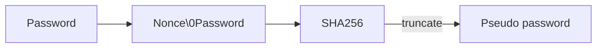

# Password Nonce

## Configuration Options

### server::redis::password_nonce
_Default: ""_<br/>
_required_

This is a random string used to concatenate it with the password. The result will be hashed and truncated and
is used in Redis.



## Example Configuration

```yaml
server:
  redis:
    password_nonce: "some-random-string-used-for-password-hashing"
```

:::note
The password_nonce is part of the Redis configuration, not a top-level configuration.
:::
