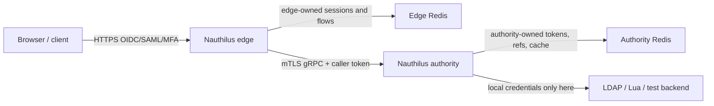
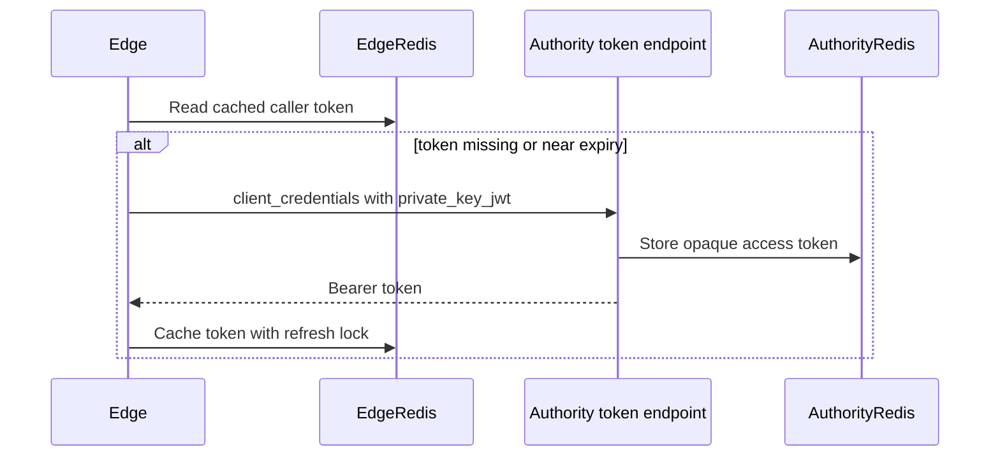
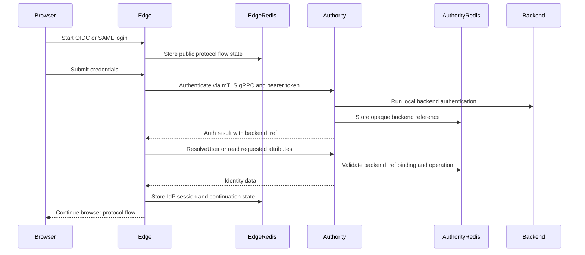
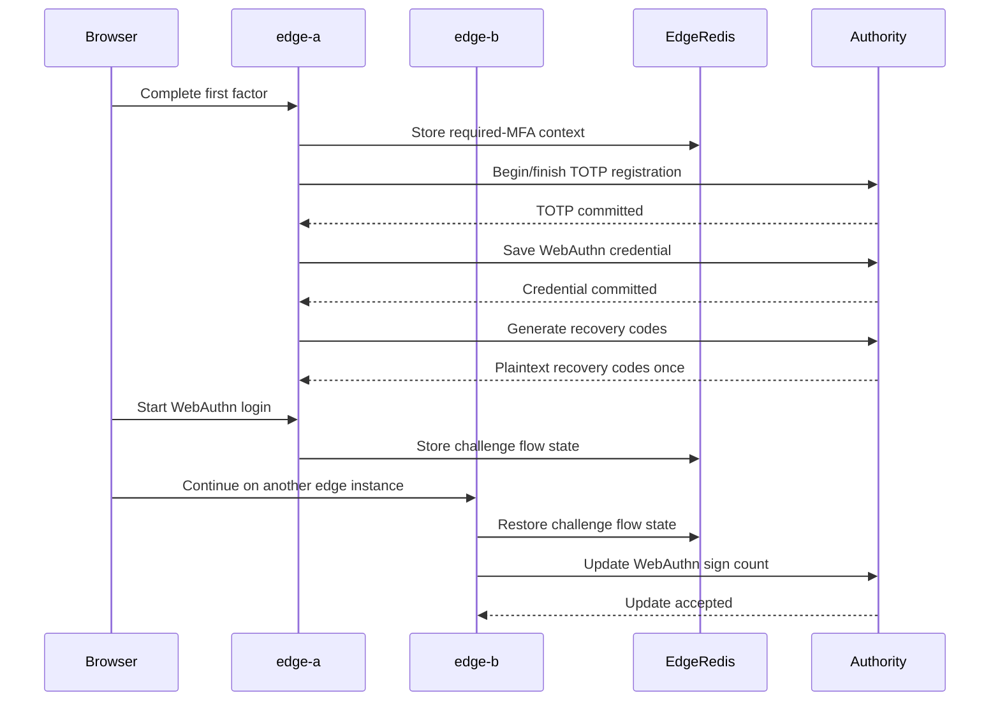

# Building a Distributed Identity Proxy

This guide shows how to build a distributed Nauthilus system with public edge instances and a private authority instance. It is written for operators who want a systematic path from the mental model to a secure deployment.

## Why Use This Architecture?

A standalone Nauthilus instance is still the simplest and best default. It can run the IdP, the authentication pipeline, local LDAP/Lua backends, MFA, WebAuthn, OIDC, SAML, policy, and observability in one process.

A distributed identity proxy is useful when the public IdP tier and the trusted identity backend tier should be separated:

- You need edge instances in a DMZ or regional frontend network.
- LDAP bind credentials, Lua backend credentials, MFA secrets, recovery-code hashes, and backend cache state must stay away from the edge.
- Multiple edge instances need to share browser flow state and continue logins after failover or load-balancer movement.
- Authority-side backend references must be short-lived, opaque, and validated on every follow-up MFA/WebAuthn operation.
- You want one hardened internal gRPC boundary instead of exposing LDAP, Lua backend stores, or authority Redis to edge nodes.

The edge remains the browser-facing IdP. The authority is not a remote OIDC token factory for the edge. Instead, the edge asks the authority for authentication, identity, MFA, WebAuthn, and attribute data through a narrow gRPC backend contract.

## What Becomes Possible?

- Public OIDC authorization-code and device-code flows on the edge with identity data resolved by the authority.
- SAML SSO on the edge with attributes resolved by the authority.
- Required TOTP registration and login through the edge while the authority owns the secret.
- Recovery-code generation and consumption through the edge while the authority owns the stored hashes.
- WebAuthn registration and login through the edge while the authority owns persistent credentials and sign-count state.
- Multi-edge continuity where a flow starts on one edge instance and completes on another through shared edge Redis.
- Defense-in-depth with mTLS, OAuth scopes, local operation allow-lists, backend-reference validation, and Redis separation.

## Security Model



The hard security rule is ownership:

| State or credential | Owner |
| --- | --- |
| Public IdP sessions and browser flow state | Edge |
| OIDC/SAML redirect, nonce, device-code, and login continuation state | Edge |
| Edge authority-token cache | Edge Redis |
| LDAP bind credentials and Lua backend credentials | Authority |
| MFA secrets and recovery-code hashes | Authority |
| WebAuthn persistent credentials | Authority |
| Authority caller access tokens | Authority Redis |
| Backend-reference payloads | Authority Redis |
| Backend cache and idempotency outcomes | Authority Redis |

The edge must not read authority Redis. The authority must not read edge Redis. They meet only over the authority gRPC channel and the authority token endpoint used for service-principal caller tokens.

## Communication Paths

### Caller Token Acquisition



### Password Login And Identity Resolution



### MFA And WebAuthn



## Build Plan

The safest way to build the system is to work from the inside out:

1. Design the trust boundaries and DNS names.
2. Deploy authority Redis and authority-local backends.
3. Configure and validate the authority instance.
4. Configure authority caller-token issuance.
5. Deploy edge Redis.
6. Configure one edge instance with a remote backend.
7. Validate direct gRPC checks before browser flows.
8. Configure OIDC/SAML clients against the edge.
9. Enable MFA and WebAuthn through the edge.
10. Add more edge instances and test continuity.
11. Tighten network policy and observability.

The following sections walk through those steps.

## 1. Design The Trust Boundaries

Pick separate names and networks:

| Component | Example |
| --- | --- |
| Public edge URL | `https://idp.example.com` |
| Authority gRPC address | `authority.internal.example:9444` |
| Authority token endpoint | `https://authority.internal.example/oidc/token` |
| Edge Redis | `edge-redis.internal:6379` |
| Authority Redis | `authority-redis.internal:6379` |
| Edge cluster id | `dmz-edge` |
| Edge instance ids | `edge-a`, `edge-b` |

Network policy should allow:

- browsers to reach the edge HTTPS listener;
- edge instances to reach edge Redis;
- edge instances to reach the authority gRPC listener;
- edge instances to reach the authority token endpoint;
- authority to reach authority Redis;
- authority to reach local backend services.

Network policy should deny:

- edge instances to authority Redis;
- authority to edge Redis;
- browsers to authority gRPC;
- browsers to the authority token endpoint when that endpoint is intended only for edge service principals;
- edge instances to LDAP/Lua backend services unless an explicit fallback backend is intentionally configured.

## 2. Prepare Certificates And Keys

Use separate material for:

- authority gRPC server certificate;
- edge mTLS client certificate;
- authority token endpoint HTTPS certificate;
- edge service-principal key for `private_key_jwt`;
- authority OIDC signing key for normal OIDC metadata and token signing.

For new deployments, prefer:

- TLS 1.3;
- mTLS for edge-to-authority gRPC;
- `private_key_jwt` for authority caller-token acquisition;
- short-lived opaque access tokens.

## 3. Configure Authority Redis

Authority Redis stores trusted authority state:

```yaml
storage:
  redis:
    primary:
      address: "authority-redis.internal:6379"
    database_number: 0
    prefix: "authority:"
    encryption_secret: "replace-with-long-random-secret"
    password_nonce: "replace-with-long-random-nonce"
```

Do not reuse edge Redis here.

## 4. Configure The Authority Backend

Use normal local backends on the authority. For LDAP:

```yaml
auth:
  backends:
    order:
      - ldap
    ldap:
      default:
        # LDAP connection, bind, search, and attribute settings
```

For Lua:

```yaml
auth:
  backends:
    order:
      - lua
    lua:
      backend:
        default:
          # Lua backend settings
```

The edge should not contain these credentials in a strict split deployment.

## 5. Enable The Authority gRPC Listener

```yaml
runtime:
  servers:
    grpc:
      authority:
        enabled: true
        address: "0.0.0.0:9444"
        tls:
          enabled: true
          cert: "/etc/nauthilus/tls/authority.crt"
          key: "/etc/nauthilus/tls/authority.key"
          client_ca: "/etc/nauthilus/tls/edge-ca.crt"
          require_client_cert: true
          min_tls_version: "TLS1.3"

auth:
  backchannel:
    oidc_bearer:
      enabled: true
```

The gRPC authority listener registers the auth service and the identity backend service. It enforces caller auth and maps missing caller credentials to transport-level authentication errors.

## 6. Configure Authority Caller Tokens

Define an authority-side OIDC client for the edge service principal:

```yaml
identity:
  oidc:
    enabled: true
    issuer: "https://authority.internal.example"
    access_token_type: "opaque"
    token_endpoint_auth_methods_supported:
      - private_key_jwt
    scopes_supported:
      - openid
      - nauthilus:authenticate
      - nauthilus:lookup_identity
      - nauthilus:list_accounts
      - nauthilus:mfa_read
      - nauthilus:mfa_verify
      - nauthilus:mfa_write
      - nauthilus:webauthn_read
      - nauthilus:webauthn_write
      - nauthilus:attribute_read
    clients:
      - name: "Edge service principal"
        client_id: "edge-primary"
        grant_types: [client_credentials]
        token_endpoint_auth_method: "private_key_jwt"
        client_public_key_file: "/etc/nauthilus/keys/edge-primary.pub"
        client_public_key_algorithm: "RS256"
        access_token_type: "opaque"
        access_token_lifetime: 5m
        scopes:
          - nauthilus:authenticate
          - nauthilus:lookup_identity
          - nauthilus:list_accounts
          - nauthilus:mfa_read
          - nauthilus:mfa_verify
          - nauthilus:mfa_write
          - nauthilus:webauthn_read
          - nauthilus:webauthn_write
          - nauthilus:attribute_read
```

Use the smallest scope set needed by that edge tier.

When the edge authenticates to `/oidc/token` with `private_key_jwt`, the assertion audience is the token endpoint URL. OIDC discovery also advertises `private_key_jwt` for `/oidc/introspect`; introspection callers must sign a separate assertion with the introspection endpoint URL as the audience.

## 7. Configure Edge Redis

Edge Redis stores only edge-owned public IdP state:

```yaml
storage:
  redis:
    primary:
      address: "edge-redis.internal:6379"
    database_number: 0
    prefix: "edge:"
    encryption_secret: "replace-with-long-random-secret"
    password_nonce: "replace-with-long-random-nonce"
```

All edge instances in the same cluster should share:

- the same edge Redis;
- the same frontend encryption secret;
- compatible OIDC issuer and signing material;
- compatible WebAuthn RP ID and origins.

## 8. Configure The Edge Authority Client

```yaml
runtime:
  clients:
    grpc:
      nauthilus_authorities:
        primary:
          address: "authority.internal.example:9444"
          timeout: 5s
          edge_cluster_id: "dmz-edge"
          edge_instance_id: "edge-a"
          tls:
            enabled: true
            server_name: "authority.internal.example"
            ca: "/etc/nauthilus/tls/authority-ca.pem"
            cert: "/etc/nauthilus/tls/edge-a.crt"
            key: "/etc/nauthilus/tls/edge-a.key"
            min_tls_version: "TLS1.3"
          caller_auth:
            oidc_bearer:
              enabled: true
              mode: "client_credentials"
              token_endpoint: "https://authority.internal.example/oidc/token"
              client_id: "edge-primary"
              token_endpoint_auth_method: "private_key_jwt"
              client_private_key_file: "/etc/nauthilus/keys/edge-primary.key"
              client_key_id: "edge-primary-rs256"
              client_assertion_alg: "RS256"
              audience: "https://authority.internal.example/oidc/token"
              scopes:
                - nauthilus:authenticate
                - nauthilus:lookup_identity
                - nauthilus:list_accounts
                - nauthilus:mfa_read
                - nauthilus:mfa_verify
                - nauthilus:mfa_write
                - nauthilus:webauthn_read
                - nauthilus:webauthn_write
                - nauthilus:attribute_read
              token_cache:
                backend: "redis"
                key_prefix: "grpc:authority_tokens:"
                refresh_before_expiry: 30s
                refresh_lock_ttl: 10s
```

Each edge node should have a unique `edge_instance_id`. All edge nodes in the same trust group should share the same `edge_cluster_id`.

## 9. Configure The Remote Backend On The Edge

```yaml
auth:
  backends:
    order:
      - remote
    remote:
      default:
        authority: "primary"
        mode: "nauthilus"
        timeout: 5s
        allowed_operations:
          - auth
          - lookup_identity
          - list_accounts
          - mfa_read
          - mfa_verify
          - mfa_write
          - webauthn_read
          - webauthn_write
          - attribute_read
```

Do not configure LDAP or Lua backend credentials on the edge unless you intentionally want a local fallback. For a strict split model, local fallback usually defeats the point of the deployment.

## 10. Configure Edge IdP Settings

Configure OIDC and SAML clients against the edge URL, not the authority URL:

```yaml
identity:
  frontend:
    enabled: true
    encryption_secret: "shared-secret-across-edge-nodes"
  oidc:
    enabled: true
    issuer: "https://idp.example.com"
```

For WebAuthn, all edge nodes that can handle the same browser flow must use a compatible RP ID and origin list:

```yaml
identity:
  mfa:
    webauthn:
      rp_display_name: "Example IdP"
      rp_id: "idp.example.com"
      rp_origins:
        - "https://idp.example.com"
        - "https://edge-a.example.com"
        - "https://edge-b.example.com"
```

If users move between edge nodes, the load balancer and the browser-facing names must still satisfy WebAuthn origin and RP checks.

## 11. Validate Configuration

Validate the authority config:

```bash
nauthilus --config /etc/nauthilus/authority.yml --config-check
```

Validate each edge config:

```bash
nauthilus --config /etc/nauthilus/edge-a.yml --config-check
nauthilus --config /etc/nauthilus/edge-b.yml --config-check
```

Then inspect non-default effective values:

```bash
nauthilus -n --config /etc/nauthilus/edge-a.yml
```

Confirm:

- edge backend order is `remote`;
- edge has no local LDAP/Lua backend credentials;
- authority client TLS is enabled;
- caller auth is enabled;
- token cache uses edge Redis;
- authority listener requires caller auth and uses TLS/mTLS;
- edge Redis and authority Redis addresses are different.

## 12. Validate The Network

From an edge host or container:

```bash
nc -vz authority.internal.example 9444
nc -vz authority-redis.internal 6379
```

The authority gRPC check should succeed. The authority Redis check should fail unless you are testing from inside the authority trust domain.

From the authority host or container:

```bash
nc -vz edge-redis.internal 6379
```

This should fail. The authority should not need edge Redis.

## 13. Validate Direct Authority Calls

Before browser testing, validate the server-to-server path:

1. Acquire an edge caller token through `client_credentials`.
2. Call `Authenticate` with mTLS and bearer metadata.
3. Call `LookupIdentity`.
4. Call `ListAccounts`.
5. Verify that missing caller auth returns an authentication error.
6. Verify that missing scope returns a permission error.
7. Verify that an expired or invalid backend reference fails closed.

The contributed E2E harness under `contrib/identity-proxy-e2e` in the Nauthilus source repository automates this pattern for local development.

## 14. Validate Browser Flows

Run browser-level checks against the edge:

- OIDC authorization-code login;
- OIDC device-code login;
- SAML SSO if you use SAML;
- required TOTP registration and login;
- recovery-code generation and login;
- WebAuthn registration and login;
- WebAuthn sign-count advancement;
- flow continuity from one edge node to another.

For automated WebAuthn checks, use a browser automation setup with a CDP virtual authenticator. Do not rely on platform authenticators such as Touch ID for repeatable CI or smoke tests.

## 15. Add More Edge Instances

For every additional edge instance:

- give it a unique `edge_instance_id`;
- keep the same `edge_cluster_id`;
- point it at the same edge Redis;
- keep the same frontend encryption secret;
- keep the same OIDC issuer and signing setup;
- keep compatible WebAuthn RP settings;
- use its own mTLS client certificate when possible;
- use the same authority service-principal policy or a deliberately scoped separate one.

Then test that an OIDC or WebAuthn flow can start on one edge and complete on another.

## Operational Checklist

Use this checklist before exposing the deployment:

- [ ] Edge and authority configs validate.
- [ ] Edge backend order is remote-only.
- [ ] Edge has no LDAP/Lua backend credentials.
- [ ] Authority has the local backend credentials and can authenticate users.
- [ ] Edge Redis and authority Redis are separate.
- [ ] Network policy blocks cross-Redis access.
- [ ] Edge-to-authority gRPC uses mTLS.
- [ ] Caller auth uses short-lived bearer tokens.
- [ ] `private_key_jwt` token-acquisition and introspection audiences are endpoint-specific.
- [ ] Edge token cache uses edge Redis.
- [ ] Authority caller tokens use authority Redis.
- [ ] Remote backend `allowed_operations` contains only needed operations.
- [ ] Authority OAuth scopes contain only needed scopes.
- [ ] Backend references are opaque handles and are not logged as secrets.
- [ ] OIDC/SAML clients point to the edge.
- [ ] WebAuthn RP ID and origins match the public edge URLs.
- [ ] Multi-edge continuity has been tested.
- [ ] Authority outage behavior is understood and fails closed for MFA mutations.

## Troubleshooting

### Edge cannot acquire a caller token

Check:

- authority token endpoint URL and network path;
- authority OIDC client id;
- `private_key_jwt` key pair and `kid`;
- expected `audience`, which should match the token endpoint for caller-token acquisition;
- authority OIDC scopes;
- authority Redis availability for opaque token storage.

### gRPC calls return unauthenticated

Check:

- `authorization: Bearer` metadata is sent;
- token is not expired;
- authority has `auth.backchannel.oidc_bearer.enabled: true`;
- mTLS client certificate is accepted when required.

### gRPC calls return permission denied

Check:

- caller token scopes;
- edge `allowed_operations`;
- backend-reference operation family;
- edge cluster id and service-principal binding.

### MFA or WebAuthn flow fails after switching edges

Check:

- both edges share edge Redis;
- both edges share the same frontend encryption secret;
- both edges use compatible OIDC issuer/signing settings;
- WebAuthn `rp_id` and `rp_origins` include the browser-facing URL;
- load balancer preserves the public host expected by WebAuthn.

### Backend reference is expired or invalid

Treat this as a fail-closed condition. The user should restart the login flow. Do not silently reconstruct authority backend state on the edge.

## Related Documentation

- [Split Identity Proxy Configuration](../configuration/identity-proxy.md)
- [Remote Authority Backend](../configuration/database-backends/remote.md)
- [gRPC Authority APIs](../grpc-api.md)
- [OIDC Configuration](../configuration/idp/oidc.md)
- [SAML2 Configuration](../configuration/idp/saml2.md)
