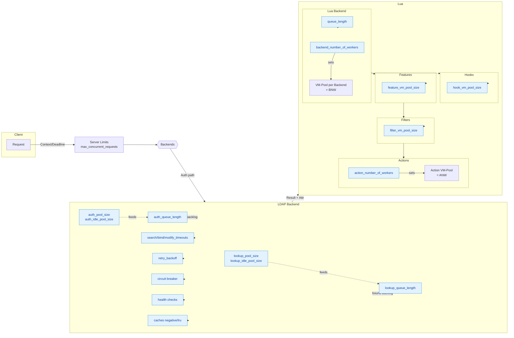
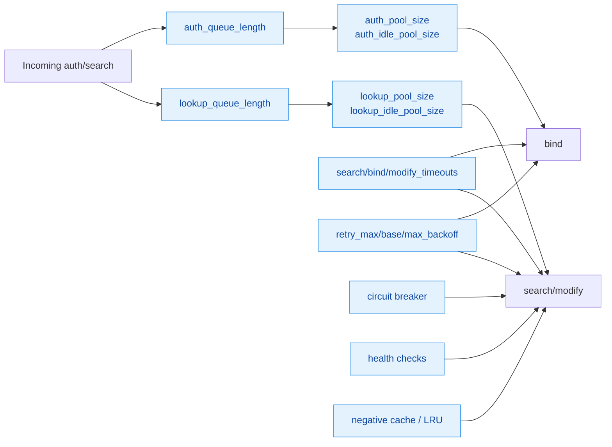
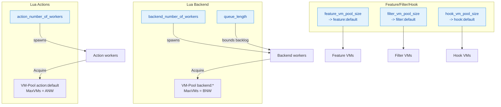

# Tuning Guide: LDAP and Lua

This guide provides pragmatic, scenario-based recommendations to tune Nauthilus for latency, throughput, and robustness. It summarizes how the most important settings interact and what to choose for typical deployments.

If you haven’t seen them yet, read these reference pages first:
- Configuration → Database Backends → [LDAP Backend](/docs/configuration/database-backends/ldap)
- Configuration → [Lua Backend](/docs/configuration/database-backends/lua)
- Configuration → [Full Configuration Example](/docs/configuration/full-example)
- Release Notes → [1.10.x](/docs/release-notes/1.10)

The recommendations below apply to Nauthilus v1.10.0 and later.

---

## Key principles (TL;DR)
- Isolate by pool/backend: separate LDAP pools and Lua backends avoid “noisy neighbor” effects.
- Shape before overload: keep queues bounded; fail fast rather than letting timeouts cascade.
- Be deadline-aware: propagate request timeouts; do not hold resources for canceled requests.
- Retry only on transients: jittered backoff; never retry auth failures.
- Keep connections and VMs warm: reuse LDAP connections and Lua VMs; housekeeping replaces broken ones.
- Cache with guardrails: short TTLs, negative caches for frequent misses; measure hit rate.
- Observe everything: queue depth/wait, errors, retries, circuit breaker state, target health.

A quick high-level overview of how the knobs fit together:



Legend: Blue nodes are configuration parameters.

---

## LDAP: what to tune and why

A quick visual of LDAP pooling, queues, and resilience knobs:



Important knobs (per pool unless stated otherwise):
- Capacity & Backpressure
  - backend_number_of_workers: worker goroutines per Lua backend (New in v1.10.0); number_of_workers is deprecated.
  - lookup_pool_size / auth_pool_size: maximum concurrent LDAP connections per pool.
  - lookup_idle_pool_size / auth_idle_pool_size: warm connections to avoid cold starts.
  - lookup_queue_length / auth_queue_length: 0 = unlimited; use small limits to protect latencies.
  - connect_abort_timeout: cap on token/connection acquisition wait; fail fast when saturated.
- Timeouts by operation
  - search_timeout, bind_timeout, modify_timeout: per-op client-side timeouts.
  - search_size_limit, search_time_limit: server-side guardrails per search.
- Resilience
  - retry_max, retry_base, retry_max_backoff: jittered retries on transient network errors.
  - cb_failure_threshold, cb_cooldown, cb_half_open_max: per-target circuit breaker.
  - health_check_interval, health_check_timeout: active target probing.
- Caching & Shaping
  - negative_cache_ttl, cache_impl (ttl|lru), cache_max_entries, include_raw_result.
- Optional protection
  - auth_rate_limit_per_second, auth_rate_limit_burst: per-pool rate limiting for auth.

Observability (Prometheus excerpts)
- Queue: ldap_queue_depth, ldap_queue_wait_seconds, ldap_queue_dropped_total
- Errors/Retry: ldap_errors_total{pool,op,code}, ldap_retries_total{pool,op}
- Targets: ldap_breaker_state, ldap_target_health, ldap_target_inflight
- Pool: ldap_pool_open_connections_total, ldap_pool_size, ldap_idle_pool_size
- Caches: ldap_cache_hits_total, ldap_cache_misses_total, ldap_cache_entries, ldap_cache_evictions_total

---

## Lua: what to tune and why

Lua worker/VM and pool sizing at a glance:



- Concurrency & Backpressure
  - backend_number_of_workers (per backend): matches VM pool size. (number_of_workers deprecated)
  - queue_length (per backend): bound pending requests; 0 = unlimited.
  - feature_vm_pool_size / filter_vm_pool_size / hook_vm_pool_size: control VM reuse capacity per category; if unset, they fall back to backend_number_of_workers.
  - Actions: VM pool size is coupled 1:1 to action_number_of_workers (no separate pool size key).
- VM lifecycle
  - VM reuse via pool; deep reset between runs prevents cross-request residue.
  - Replace VM on hard errors/timeouts; count via lua_vm_replaced_total.
- Observability
  - lua_queue_depth, lua_queue_wait_seconds, lua_queue_dropped_total
  - lua_vm_in_use, lua_vm_replaced_total

---

## Ready-made scenarios

Below are prescriptive configurations you can copy and adapt. Values are indicative; always validate with your metrics.

### 1) Small single-node (tens of RPS, low latency LAN)
Goal: predictable latency without overengineering.

LDAP (default pool)
```yaml
ldap:
  config:
    number_of_workers: 8
    lookup_pool_size: 8
    lookup_idle_pool_size: 2
    auth_pool_size: 8
    auth_idle_pool_size: 2
    lookup_queue_length: 16    # ~2x pool; small buffer
    auth_queue_length: 16
    connect_abort_timeout: 5s

    search_timeout: 2s
    bind_timeout: 2s
    modify_timeout: 2s

    search_size_limit: 200
    search_time_limit: 2s

    retry_max: 2
    retry_base: 200ms
    retry_max_backoff: 2s

    cb_failure_threshold: 5
    cb_cooldown: 30s
    cb_half_open_max: 1

    health_check_interval: 10s
    health_check_timeout: 1.5s

    negative_cache_ttl: 20s
    cache_impl: ttl
    cache_max_entries: 5000
    include_raw_result: false
```

Lua (default backend)
```yaml
lua:
  config:
    backend_number_of_workers: 4  # New in v1.10.0
    queue_length: 16        # ~4x workers; absorb brief spikes
```

When to change
- See queue_wait_seconds p95 > 50–100ms → increase pool_size or reduce queue_length to fail fast.
- Many dropped_total → raise queue_length slightly or increase pool size.

---

### 2) Bursty traffic with strict p99 (APIs or login storms)
Goal: keep tail latency low under bursts; shed excess quickly.

LDAP per pool
```yaml
lookup_pool_size: 16
lookup_idle_pool_size: 4
auth_pool_size: 16
auth_idle_pool_size: 4
lookup_queue_length: 16    # ~= pool_size (tight queue)
auth_queue_length: 16
connect_abort_timeout: 2s
search_timeout: 1.5s
bind_timeout: 1.5s
retry_max: 1               # smaller to avoid retry storms
```

Extras
- Enable per-pool auth rate limiting if necessary:
```yaml
auth_rate_limit_per_second: 10
auth_rate_limit_burst: 20
```

Lua per backend
```yaml
backend_number_of_workers: 8  # New in v1.10.0
queue_length: 16           # small, predictable backlog
```

Signals to watch
- ldap_queue_dropped_total rising during bursts means limits are protecting the system.
- p99 waits still high → raise pool_size a bit (4–8 at a time) or reduce queue_length further.

---

### 3) Mixed pools (default + mail), avoiding interference
Goal: isolate workloads; tune per-pool limits.

```yaml
ldap:
  config:
    lookup_pool_size: 12
    auth_pool_size: 12
    lookup_queue_length: 24
    auth_queue_length: 24
  optional_ldap_pools:
    mail:
      lookup_pool_size: 6           # smaller, independent
      auth_pool_size: 6
      lookup_queue_length: 12
      auth_queue_length: 12
```

What to verify
- Each pool shows its own queue_depth and p95 waits. A busy mail pool won’t affect default.

---

### 4) WAN/High-latency LDAP (50–200 ms RTT)
Goal: hide network variance; avoid long hangs.

```yaml
lookup_pool_size: 24
lookup_idle_pool_size: 4
auth_pool_size: 24
auth_idle_pool_size: 4
connect_abort_timeout: 3s    # fail fast on saturation
search_timeout: 3s
bind_timeout: 3s
retry_max: 2
retry_base: 300ms
retry_max_backoff: 3s
search_time_limit: 3s
```

- Keep queue_length modest (e.g., 16–24).
- Consider stronger negative caching if you see many misses: negative_cache_ttl: 30s.

---

### 5) Active Directory specifics
Goal: reduce server load; keep filters/index-friendly.

- Prefer selective filters using indexed attributes (sAMAccountName, mail, userPrincipalName).
- Keep search_size_limit conservative (100–300); use search_time_limit 2–3s.
- Timeouts slightly higher than OpenLDAP defaults (bind/search ~2–3s).
- If DCs are geo-distributed, use multiple ServerURIs; let health checks and circuit breaker steer.

---

### 6) Read-heavy lookups with frequent misses
Goal: cut load with negative caching and stampede protection.

```yaml
negative_cache_ttl: 30s
cache_impl: lru
cache_max_entries: 10000
```

- Expect ldap_cache_hits_total(type="neg") to grow; hit rate > 60% on hot paths is common.
- Evictions are visible with LRU; for shared TTL cache, evictions are reported with pool="shared", type="ttl".

---

### 7) Auth-heavy systems with abuse potential
Goal: maintain availability under bad traffic.

- Use small queues (8–16) and connect_abort_timeout 2s.
- Consider enabling auth_rate_limit_per_second/burst per pool.
- Ensure brute-force protections are configured (outside this guide).

---

### 8) Lua backends: low latency
Goal: sub-5ms average VM scheduling.

```yaml
lua:
  config:
    number_of_workers: 8
    queue_length: 16
```

- Watch lua_vm_in_use (should oscillate under the MaxVMs level) and lua_queue_wait_seconds.
- If p95 wait > 10–20 ms, either raise number_of_workers or lower queue_length to reduce backlog.

---

## Step-by-step tuning playbook

1) Establish targets
- Decide acceptable p95/p99 for search/bind, and max drop rates.

2) Baseline
- Start with moderate pool sizes (8–16), modest queues (1–2× pool), timeouts 1–3s.
- Keep include_raw_result: false.

3) Protect
- Set connect_abort_timeout (2–5s). Enable queue_length limits.
- For auth storms, consider per-pool rate limits.

4) Measure (at least 24–48h)
- ldap_queue_wait_seconds p95/p99 per pool & type
- ldap_errors_total by op/code; ldap_retries_total
- ldap_target_health/_inflight & breaker_state per target
- ldap_cache_* hit/miss/entries (+ evictions)
- lua_queue_* and lua_vm_* for Lua

5) Iterate
- If queues are empty but latency is high → increase timeouts a bit or check server indices/filters.
- If queues are deep with high waits → increase pool_size (in steps), or reduce queue_length to shed.
- If retries spike → adjust retry_max/backoff; investigate network.
- If breaker stays open → some targets are unhealthy; check health checks, TLS, DNS, routing.

6) Validate under load
- Re-run realistic traffic with the new limits. Look for stable p95/p99 and low error/retry rates.

---

## Quick cheat sheet (typical starting points)

- Pool sizes: 8–16 (small); 16–32 (medium); >32 only if justified by CPU/IO.
- Queue length: 1–2× pool size (tight queues for predictability).
- Timeouts: 1–3s (LAN); 2–4s (WAN); modify based on server policy.
- Retries: retry_max=1–2; base=200–300ms; max_backoff=2–3s.
- Breaker: threshold=5; cooldown=30s; half_open_max=1.
- Health checks: interval=10s; timeout=1.5s.
- Negative cache TTL: 20–30s; LRU up to 5k–10k entries on hot paths.
- Lua workers: align with expected concurrency; start at 4–8; queue_length ~ workers to 2× workers.

---

### Dependencies cheat sheet (compact)

```mermaid
graph TD
  backend_number_of_workers --> backend_vm_pool_size
  backend_number_of_workers -.1:1.-> backend_vm_pool_size
  action_number_of_workers --> action_vm_pool_size
  action_number_of_workers -.1:1.-> action_vm_pool_size
  feature_vm_pool_size --> feature_parallelism
  filter_vm_pool_size --> filter_parallelism
  hook_vm_pool_size --> hook_parallelism
  queue_length --> backend_backlog
  lookup_pool_size --> lookup_parallelism
  auth_pool_size --> auth_parallelism
  lookup_queue_length --> lookup_backlog
  auth_queue_length --> auth_backlog
  search_timeout --> search_latency_bounds
  bind_timeout --> bind_latency_bounds
  retry_max --> potential_amplification
  cb_failure_threshold --> breaker_sensitivity
  cache_max_entries --> cache_memory
```



## Troubleshooting checklist

- Spiky latency, no drops → queues too large; reduce queue_length, set connect_abort_timeout.
- Many drops, low utilization → queues too small or rate limits too strict; raise queue length slightly.
- Frequent retries → transient network issues; check TLS/timeouts; tune retry_* values.
- Breaker stays open → persistent backend issues; verify certs, routing, server logs.
- Cache hit rate low → verify key choice (pool|baseDN|filter); ensure negatives are cached; consider longer TTL or LRU.
- Lua errors/VM replacement high → inspect scripts for long loops; add cooperative cancellation; reduce per-call timeouts if any.

---

## Appendix: mapping scenarios to metrics

| Symptom                  | Primary metrics                                         | Typical fix                               |
|--------------------------|---------------------------------------------------------|-------------------------------------------|
| High p95 queue wait      | ldap_queue_wait_seconds, ldap_queue_depth               | increase pool_size; reduce queue_length   |
| Many queue drops         | ldap_queue_dropped_total                                | slightly raise queue_length; add workers  |
| Repeated network errors  | ldap_errors_total{code="network"}, ldap_retries_total   | tune retry_*; check network/TLS           |
| Single target overloaded | ldap_target_inflight, ldap_breaker_state, target_health | confirm health loop; add URIs; fix target |
| Low cache efficiency     | ldap_cache_hits_total vs misses                         | increase TTL/entries; verify keys         |
| Lua backlog              | lua_queue_depth/wait_seconds, lua_vm_in_use             | raise workers or lower queue_length       |

---

Still unsure what to pick? Start with the Small single-node scenario, deploy, and use the playbook to iterate with your data. That approach leads to stable, explainable settings in a few rounds.


## Scoped IP dedup for account metrics (v1.10.0)

Many modern clients rotate IPv6 privacy addresses and large deployments sit behind NAT/CGNAT. Counting raw IPs can inflate per‑account "unique IPs" and trigger false positives in protection heuristics. Starting with v1.10.0, Lua features can normalize IPs using CIDR scoping via the Go scoper.

### Recommended starting points
- IPv6: `lua.config.ip_scoping_v6_cidr: 64`
- IPv4: `lua.config.ip_scoping_v4_cidr: 24`

These values reduce noise from privacy addresses and NAT pools while still differentiating typical households and offices.

### Configuration example
```yaml
lua:
  config:
    # Normalize client IPs in Lua features (e.g., long-window metrics)
    ip_scoping_v6_cidr: 64  # /64 for IPv6 privacy rotation
    ip_scoping_v4_cidr: 24  # /24 for IPv4 NAT aggregation
```

### Using from Lua
Use the Go‑backed helper to get a stable identifier:

```lua
local misc = require("nauthilus_misc")
local scope = misc.scoped_ip("lua_generic", request.client_ip)
-- Use `scope` for HyperLogLog/ZSET keys instead of the raw IP
```

The built‑in `account_longwindow_metrics.lua` feature already uses scoped IPs in 1.10.0.

### Threshold tuning
With scoping enabled, the metrics `uniq_ips_24h` and `uniq_ips_7d` typically decrease. Adjust Account Protection thresholds accordingly:
- Start with the defaults, then increase/decrease in small steps based on observed baselines.
- Consider environment characteristics (mobile user base, roaming clients, heavy NAT).

### Enforcement strategy
- New default (v1.10.0): protection runs in dry‑run by default (no block). Toggle enforcement via the `PROTECT_ENFORCE_REJECT` env var when you are confident in the thresholds.
- Let the frontend (IdP/reverse proxy) render the challenge based on the headers:
  - `X-Nauthilus-Protection`, `X-Nauthilus-Protection-Reason`, and optional `X-Nauthilus-Protection-Mode: dry-run`.
