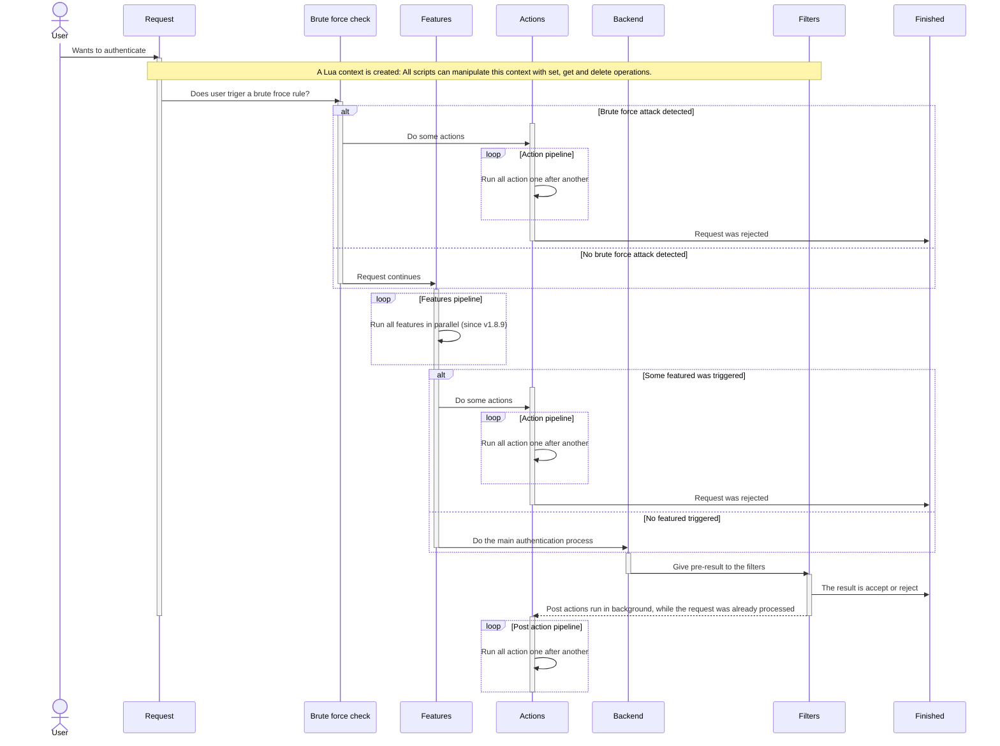

# Lua Support

Nauthilus has Lua 5.1 support in all areas of the service. To understand the interfaces, you must first get an idea of
what happens with an incoming authentication request.

## Authentication workflow

An incoming authentication request first enters the **brute\_force** check. After that it continues with the **features**
pipeline. After that has past, it continues to process the request in a **password backend**. When the final result for the
request was obtained, it passes **filters**.

Filters may change the backend result in one or the other way (accepting a formely rejected message or vice versa). This
is especially useful for other remote services that can influence the authentication process.

After all this has finished, it is possible to do some **post actions**, which are run independent
of all other steps in the whole pipeline and therefore can not influence the final result anymore.

In the following sequence diagram you can see the processing of the request in more detail.



## Additional things to know

When starting the server, it is possible to call an init script, which may be used to register prometheus elements, start
connection tracker or define custom redis pools. The latter is interesting, if you prefer using other redis servers for all
your custom Lua scripts.

### While runtime...

When an incoming authentication request is started, a Lua context is created.

All parts of a request share that common request context. Lua scripts can set arbitrary data in the context and read/delete
things from there.

Lua scripts can modify the final log line by adding key-value pairs from each script.

---

## Configuration

For the configuration, please have a look for the [configuration file](/docs/configuration/index.md) document.

---

## Lua components

Each component does provide a set of global functions, constants, ... and requires a well-defined response from each request.

Every Lua script that has been configured is pre-compiled and kept in memory for future use. To make script changes, you
must reload the service.

---

## Lua libraries

Nauthilus does automatically preload Lua modules.

This is the list of modules that are currently available:

| Loader name                 | Description                                        |
|-----------------------------|----------------------------------------------------|
| nauthilus\_mail             | E-Mail functions                                   |
| nauthilus\_password         | Password compare and validation functions          |
| nauthilus\_redis            | Redis related functions                            |
| nauthilus\_misc             | Country code and sleep functions                   |
| nauthilus\_context          | Global Lua context accross all States in Nauthilus |
| nauthilus\_ldap             | LDAP related functions                             |
| nauthilus\_backend          | Backend related functions                          |
| nauthilus\_http_request     | HTTP request header functions                      |
| nauthilus\_http_response    | HTTP response functions (headers, status, body; Filters/Features MUST NOT send a body)     |
| glua\_crypto                | gluacrpyto project on Github                       |

Example:

```lua
local nauthilus_redis = require("nauthilus_redis")

local nauthilus_builtin_context = require("nauthilus_context")

-- Gopher-Lua-Libs

local crypto = require("crypto")

local db = require("db")

local time = require("time")

-- Glua-Crypto

local crypto = require("glua_crypto") -- provides sha1 and others...
```

### Actions

Whenever a brute froce attack is recognized, **action**s may be called. The request will wait until all requests have
finished. Actions are processed by a central action worker. No results are returned to the regular request, so actions
in general do their own logging!

Also, **features** may call actions if they were triggered. The request is waiting to finish all actions by the worker
process.

### Features

Besides the well known features geoip, rbl, tls\_encryption and relay\_domains, a new feature has been integrated: lua. This
feature is processed before all other features (in fact, you might replace all these features with pure Lua...). Lua-features
are executed in parallel starting with v1.8.9. As soon as any feature has triggered, the request will reject the authentication process after all features have finished, and the results are aggregated.

:::note Version change in 1.8.9
Since version 1.8.9, Lua features and filters are executed in parallel. Nauthilus waits for all scripts to finish and then aggregates their results:
- Features: triggered=true if any script reports FEATURE_TRIGGER_YES; abort flag is set if any script requests FEATURES_ABORT_YES; the first error aborts the whole operation; the first status_message set is used.
- Filters: an action is taken if any filter requests it; backend_result attributes from multiple filters are merged (later keys overwrite earlier ones); remove-attributes are unioned; the first error aborts; the first status_message set is used.
Each script runs with its own Lua state and per-script timeout. Do not rely on execution order between scripts.
:::
Furthermore, Lua features can set a flag to bypass all built-in features.

### Lua backend

A new backend has been implemented. It can be used for all features that Nauthilus currently supports: Checking passwords,
running different modes (no-auth, list-accounts), adding TOTP...

The backend can accept a request or reject it. It has full access to all meta information that are delivered from the
incoming request.

### Filters

There may exist remote services that may be contacted after the main backend authentication proccess returned its first  
result. Think of something like GeoIP service or some IP white/blacklisting. Even a request that might have authenticated
correctly may be rejected to a policy violation from such a service. Therefor filters have the power to overwrite the
result from a backend.

You can also use filters to retrieve additional information from databases or LDAP and add additional attributes to the remaining result.
This is useful for setups, where Nauthilus may also take the role of a Dovecot proxy. Users may get routed to different
mail stores upon successful authentication. For this, you may retrieve the current backend server list with servers that have been
checked as being alive with the **backend\_server\_monitoring** feature and select nominate it for the current client request.

:::info
Filters never affect caching! This is important, because otherwise valid credentials might result in storing them in the
negative password cache or vice versa for invalid credentials.
:::

:::warning
You always have to deal with the "request.authenticated" flag! If you don't care enough, you might acidentially reject
legitimate authenticated users or allow bad guys.
:::

### Post actions

Post actions are actions, which run after the request hast come to its final result. Its main purpose is to start some
automated things like doing statistics stuff, sending messages to operators or anything else that does not require fast
instant processing.

As an example have a look at the telegram script. Lua scripts in earlier stages of the process may provide some
information by using the Lua context. The telegram script may pick up these information and decide to send out some
notifications to an operator channel.

---

## Required functions and constants

Every Lua script must provide a pre-defined Lua function with a request parameter. Concerning the actual script, there is
a requried return statement.

Nauthilus will look for these functions and parses the results.

---

## Common request fields for all Lua scripts

The following request fields are supported

| Name                     | Type   | Precense | Additional info                                                   |
|--------------------------|--------|----------|-------------------------------------------------------------------|
| debug                    | bool   | always   | -                                                                 |
| repeating                | bool   | maybe    | -                                                                 |
| user_found               | bool   | maybe    | -                                                                 |
| authenticated            | bool   | maybe    | -                                                                 |
| no_auth                  | bool   | always   | true, if the reuqest is used to retrieve user information         |
| service                  | string | always   | Nauthilus endpoint like "dovecot" or "nginx"                      |
| session                  | string | always   | -                                                                 |
| client\_ip               | string | always   | -                                                                 |
| client\_port             | string | always   | -                                                                 |
| client_net               | string | maybe    | Available in conjunction with brute-force-actions                 |
| client\_id               | string | maybe    | -                                                                 |
| user\_agent              | string | maybe    | -                                                                 |
| local\_ip                | string | always   | -                                                                 |
| local\_port              | string | always   | -                                                                 |
| username                 | string | always   | -                                                                 |
| account                  | string | maybe    | Filter and post actions                                           |
| unique\_user\_id         | string | maybe    | Used with OIDC subject                                            |
| display\_name            | string | maybe    | -                                                                 |
| password                 | string | always   | -                                                                 |
| protocol                 | string | always   | -                                                                 |
| brute\_force\_bucket     | string | maybe    | Available in conjunction with brute-force-actions                 |
| feature                  | string | maybe    | In actions, if a feature has triggered                            |
| status\_message          | string | always   | Current status message returned to client, if auth request failed |
| ssl                      | string | maybe    | HAproxy: %[ssl\_fc]                                               |
| ssl\_session\_id         | string | maybe    | HAproxy: %[ssl\_fc\_session\_id,hex]                              |
| ssl\_client\_verify      | string | maybe    | HAproxy: %[ssl\_c\_verify]                                        |
| ssl\_client\_dn          | string | maybe    | HAproxy: %\{+Q\}[ssl\_c\_s\_dn]                                   |
| ssl\_client\_cn          | string | maybe    | HAproxy: %\{+Q\}[ssl\_c\_s\_dn(cn)]                               |
| ssl\_issuer              | string | maybe    | HAproxy: %\{+Q\}[ssl\_c\_i\_dn]                                   |
| ssl\_client\_not\_before | string | maybe    | HAproxy: %\{+Q\}[ssl\_c\_notbefore]                               |
| ssl\_client\_not\_after  | string | maybe    | HAproxy: %\{+Q\}[ssl\_c\_notafter]                                |
| ssl\_subject\_dn         | string | maybe    | HAproxy: %\{+Q\}[ssl\_c\_s\_dn]                                   |
| ssl\_issuer\_dn          | string | maybe    | HAproxy: %\{+Q\}[ssl\_c\_i\_dn]                                   |
| ssl\_client\_subject\_dn | string | maybe    | HAproxy: %\{+Q\}[ssl\_c\_s\_dn]                                   |
| ssl\_client\_issuer\_dn  | string | maybe    | HAproxy: %\{+Q\}[ssl\_c\_i\_dn]                                   |
| ssl\_protocol            | string | maybe    | HAproxy: %[ssl\_fc\_protocol]                                     |
| ssl\_cipher              | string | maybe    | HAproxy: %[ssl\_fc\_cipher]                                       |

:::note
TLS-related values may be retrieved from Nginx and as a fallback tried to be retrieved from HAproxy headers.
:::

:::tip
It is always a good idea to check the value of a request field, before using it.
:::

### Features

A Lua feature script must provide the following function:

```lua
---@param request table
---@return number, number, number
function nauthilus_call_feature(request)
  return trigger, skip_flag, failure_info -- See details below
end
```

:::important
It must return three values: The trigger state, a flag that indicates, if other features shall be skipped and a third value
which is an indicator for errors that occurred in the script itself.
:::

#### Constants for the returned result

| Constant                                | Meaning                                                         | Value | Category      |
|-----------------------------------------|-----------------------------------------------------------------|-------|---------------|
| nauthilus_builtin.FEATURE\_TRIGGER\_NO  | The feature has not been triggered                              | 0     | trigger       |
| nauthilus_builtin.FEATURE\_TRIGGER\_YES | The feature has been triggered and the request must be rejected | 1     | trigger       |
| nauthilus_builtin.FEATURES\_ABORT\_NO   | Process other built-in features                                 | 0     | skip\_flag    |
| nauthilus_builtin.FEATURES\_ABORT\_YES  | After finishing the script, skip all other built-in features    | 1     | skip\_flag    |
| nauthilus_builtin.FEATURE\_RESULT\_OK   | The script finished without errors                              | 0     | failure\_info |
| nauthilus_builtin.FEATURE\_RESULT\_FAIL | Something went wrong while executing the script                 | 1     | failure\_info |

### Request fields

Only common request fields are present.

### Filters

A Lua filter script must provide the following function:

```lua
---@param request table
---@return number, number, number
function nauthilus_call_filter(request)
  if request.authenticated then
    -- do something
  end

  return filter_action, failure_info -- See details below
end
```

:::important
It must return three values: The trigger state, a flag that indicates, if other features shall be skipped and a third value
which is an indicator for errors that occurred in the script itself.
:::

#### Constants for the returned result

| Constant                                 | Meaning                                         | Value | Category       |
|------------------------------------------|-------------------------------------------------|-------|----------------|
| nauthilus_builtin.FILTER\_ACTION\_ACCEPT | The request must be accepted                    | 0     | filter\_action |
| nauthilus_builtin.FILTER\_ACTION\_REJECT | The request has to be rejected                  | 1     | filter\_action |
| nauthilus_builtin.FILTER\_RESULT\_OK     | The script finished without errors              | 0     | filter\_info   |
| nauthilus_builtin.FILTER\_RESULT\_FAIL   | Something went wrong while executing the script | 1     | filter\_info   |

### Request fields

Only common request fields are present.

### Actions (including post)

A Lua action script must provide the following function:

```lua
---@param request table
---@return number
function nauthilus_call_action(request)
  if request.no_auth then
    -- Example post action: Store request information in database
  end

  return failure_info -- See details below
end
```

:::important
Actions must return the script status constant.
:::

#### Constants for the returned result

| Constant                               | Meaning                            | Value | Category      |
|----------------------------------------|------------------------------------|-------|---------------|
| nauthilus_builtin.ACTION\_RESULT\_OK   | The script finished without errors | 0     | failure\_info |
| nauthilus_builtin.ACTION\_RESULT\_FAIL | The script finished with errors    | 1     | failure\_info |

### Request fields

Only common request fields are available.

### Lua Backend

The Lua backend script must provide the following function:

```lua
---@param request table
---@return number, userdata
function nauthilus_backend_verify_password(request)
  local backend_result_object = backend_result:new()
  -- Do something with backend_result_object

  return failure_info, backend_result_object -- See details below
end
```

For user account listing, the following function is required:

```lua
---@param request table
------@return number, table
function nauthilus_backend_list_accounts(request)
  local accounts = {}

  return failure_info, accounts -- See details below
end
```

If you plan on adding TOTP-keys for your users, you must provide the follwing function:

```lua
---@param request table
---@return number
function nauthilus_backend_add_totp(request)
  return failure_info -- See details below
end
```

:::important
The backend must return the result status constant and a backend result object
:::

#### Constants for the returned result

| Constant                                | Meaning                            | Value | Category      |
|-----------------------------------------|------------------------------------|-------|---------------|
| nauthilus_builtin.BACKEND\_RESULT\_OK   | The script finished without errors | 0     | failure\_info |
| nauthilus_builtin.BACKEND\_RESULT\_FAIL | The script finished with errors    | 1     | failure\_info |

### Request fields

### Function nauthilus\_backend\_verify\_password request fields

Only common request fields are used.

### Function nauthilus\_backend\_list\_accounts request fields

Only "debug" and "session" from the common requests are available.

#### Function nauthilus\_backend\_add\_totp request fields

Only "debug" and "session" from the common requests as well as "totp\_secret" (string)  are available.

---

## UserData object backend\_result

The **nauthilus\_backend\_result** object can be initialized in the Lua backend and in Lua filters. The following methods exist:

### backend

| Name                    | Meaning                                                                                      |
|-------------------------|----------------------------------------------------------------------------------------------|
| authenticated           | Set or get the authentication status                                                         |
| user\_found             | Set or get the user found flag which indicated, if the backend found the user                |
| account\_field          | Set or get the account field name, which must have been added to a list of result attributes |
| totp\_secret\_field     | Set or get the TOTP secret field name, which must have been added to the result attributes   |
| totp\_recovery\_field   | Not yet implemented                                                                          |
| unique\_user\_id\_field | Set or get the unique user id field, which must have been added to the result attributes     |
| display\_name\_field    | Set or get the display name field, which must have been added to the result attributes       |
| attributes              | Set or get the result attributes as a Lua table                                              |

### filters

Filters only have an "attributes" method. While Lua backends do return a **nauthlus\_backend\_result** directly, filters can only
apply it with a Lua function called "nauthilus_backend.apply\_backend\_result(backend\_result\_object)".

Attributes can not overwrite existing attributes!

### Example usage for nauthilus\_backend\_result

```lua
local attributes = {}
attributes["account"] = "bob"

local b = nauthilus_backend_result.new()
b:attributes(attributes) -- Add the table
b:account_field("account") -- Attributes contain a key "account" for the account field
b:authenticated(true) -- User is authenticated
b:user_found(true) -- The user was found
```

#### Endpoints /api/v1/mail/dovecot, /api/v1/generic/user and /api/v1/generic/json

"attributes" represent a common result store for a backend query. All fields that have been set by \*\_field methods will be
used for further internal processing, while all other attributes will be converted to HTTP-response-headers, which will be
sent back to the client application that talked to Nauthilus. These headeres will be prefixed with **X-Nauthilus-**.

For the generic endpoints, "attributes" will bew returned in the JSON respone.

---

## Additional notes

Nauthilus uses the gopher-lua-libs library in all Lua scripts. Please have a look at their documentation for all the modules
that can directly be used in Nauthilus scripts:

[gopher-lua-libs on Github](https://github.com/vadv/gopher-lua-libs)
